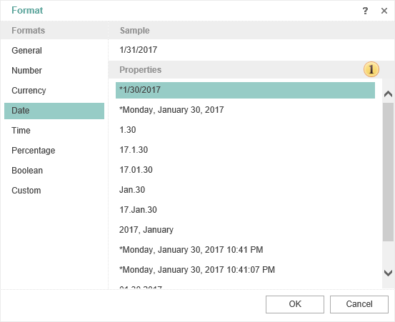

## Date

The format **Date** is used to show a date. The format has different output options - short date format, extended date format etc. In all formats, except the ones which are marked with the (*) symbol, the order of elements is not changed.

 **Date Format**

The list of formatting types.
