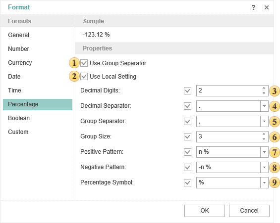

## Percentage

This format is used to show percent values. When formatting, the value is multiplied by 100 and is output with the percent symbol.

 Use Group Separator

When the Group Separator is used then currency values will be separated into number positions.

 **Use Local Setting**

When using the Local settings, numerical values are formatted according to the current OS installations.

 **Decimal Digits**

Number of decimal digits, which are used to format numerical values.

 **Decimal Separator**

Used as a decimal separator to separate numerical values in formatting.

 **Group Separator**

Used as a group separator when numerical values formatting.

 **Group Size**

The number of digits in each group in currency values formatting.

 **Positive Pattern**

This pattern is used to format positive values.

 **Negative Pattern**

This pattern is used to format negative values.

 **Percentage Symbol**

The symbol will used as a percent symbol.
