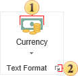

## Text Formats

The tool **Text Format** allows formatting values in the special form. Formatting affects on the text object entirely. For example, if the text component is used to display the date, the formatting is very easy. If you want to format only a specific value of the expression, or to format multiple values ​​in a single expression, it is recommended to use the method **string.Format**. Using this method you can perform almost all the types of formatting that you can do with the tool **Text Format**. The group of controls to format text is shown on the picture below.

 Select text format.

 Call a form of formats editing.
