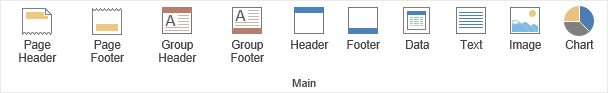

## Components

The toolbox is a group of components for easy access. Accordingly, this group is customizable, i.e. required components can be added to the group or removed from it. Below is the default state of a Toolbox group.

