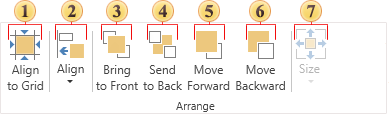
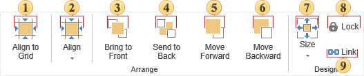
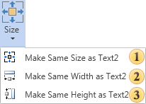

## Arrange

The group contains a large number of commands used to change the position of components on a page.

 Align all selected components to the page grid.

 Align selected components. This element contains submenu and short description in this topic below.

 Bring selected components to Front.

 Send selected components to Back.

 Move selected components on one level forward.

 Move selected components on one level backward.

 Choose the size of selected components. It contains submenu and is described in this topic below.

 The Lock command prevents moving or changing the size of components.

 The Link command links the component to the container in which it is located.

* The description of the **Align** button, specified with number 2 on the picture above.

 Align all selected components to their common left margin.

 Align horizontally all selected components to their common center.

 Align all selected components to their common right margin.

 Align all selected components to their common top margin.

 Align vertically all selected components to their common center.

 Align all selected components to their common bottom margin.

 Make horizontal spacing of selected components equal by their width.

 Make vertical spacing of selected components equal by their height.

 Center all selected components horizontally.

 Center all selected components vertically.

* The description of the **Size** button, specified with number 7 on the topmost picture.

 Make the same size of components as the size of the first selected component.

 Make the same width of components as the size of the first selected component.

 Make the same height of components as the size of the first selected component.
