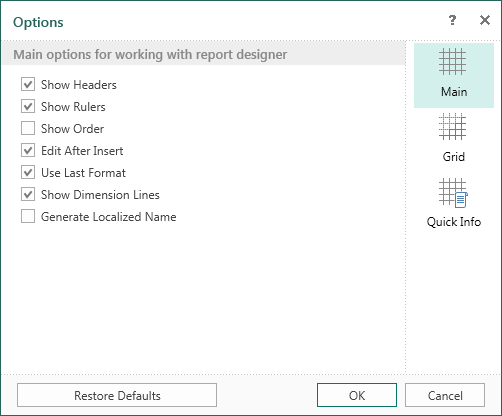
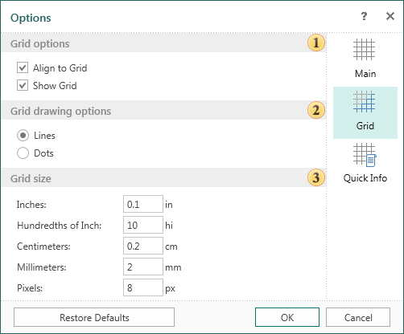
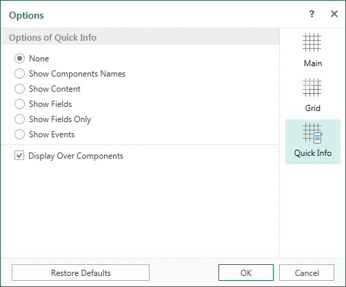

## Parameters

In the **Options** menu you can find advanced settings of the report designer. These settings are located on the following tabs:

* The **Main** tab contains the basic settings. For example, headers, rules, etc. Select the check box to turn on the option you want.

* The **Grid** tab contains grid settings in the report designer. For example, on this tab, you can turn on the grid, alignment, the way to draw the grid (line or point), set the unit for the grid.

* On the **Quick Info** tab you can select the information that will displayed for the components.

