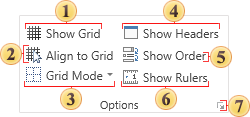

## Viewing Options

The group contains items to configure various settings of displaying some staff on the page in the report template.

 The command **Show Grid**. Makes the grid on the page visible in the report template.

 The command **Align to Grid**. Automatically aligns by the grid the components on the page.

 The command **Grid Mode**. Sets the grid style. The grid may look as lines or dots.

 The command **Show Headers**. This command provides the ability to show or hide headers of bands.

 The command **Show Order**. Shows or hides the order of placing items on the page of a report template.

 The command **Show Ruler**. Shows rulers on the page.

 The button to call the menu [Parameters](Options.md).
