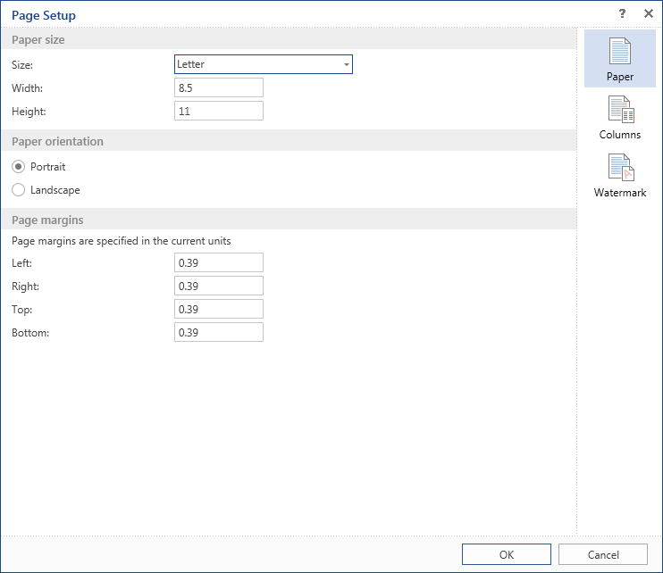
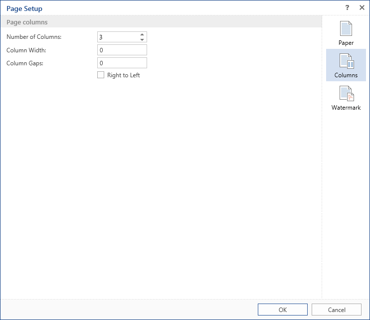
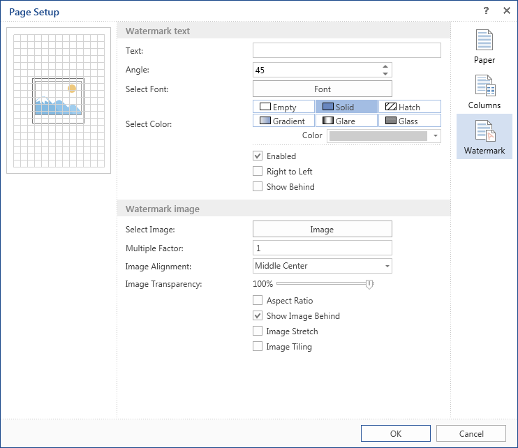

## Page Setup

This group contains elements to control basic parameters of a page. These are page margins, orientation, page size, columns.

 The tab **Paper** contains settings such as:

* **Paper Size**. Sets width, height, and supports the ability to select the standard paper size. Width, height are displayed in units of the report.

* **Page Orientation**. Supports two options - portrait and landscape.

* **Page Margins**. Sets left, right, top, and bottom margins. Values ​​are specified in units of the report.

 The tab **Columns** contains page column settings:

* Specifies the number of columns from 0 to 100.

* Specifies the width of columns if the automatically generated size is not good.

* You can also specify the spacing between columns.

* The mode of column positions. By default, the columns are output from left to right. You can change the output order to the from right to left by checking the parameter **Right to Left**.

 The tab **Watermark** contains settings to output a watermark on the page of the report template:

* The first group of parameters provides the ability to set the text and change its properties (color, angle, font, etc.).

* You can set an image as the watermark. You can setup the scale, transparency, image cropping etc.

* On the preview panel on the top left side of the dialog form Watermark panel you can see as thumbnail of the report template page and a watermark added. Changes are immediately shown there.

* **Notice**: When you add an image to the watermark, the value of parameter **Image Transparency** is set to **0**. So you should set the necessary transparency manually.
