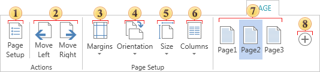

## Tab Page

On the tab **Page** you can find tools to control the parameters of pages in the report template.

 The button **Page Setup**. The button opens the page setup form.

 The buttons **Move Left** and **Move Right**. Move the selected page in the list of pages of the report template. It is understood that pages of the template are rendered sequentially. Consider the following example. Suppose there is a report template with 3 pages Page1, Page2, Page3. When rendering a report, the pages will be processed sequentially, in our case the Page1 rendered first, then Page2, and Page3. Select the Page3 and move it to the left position. Now the order of the pages in the list is Page3, Page1, Page2. Respectively, Page3 will be rendered first, and Page2 is rendered last.

 The button Margins. Opens a drop-down menu with preset options:

  * Normal

  * Narrow

  * Wide

 The button **Orientation**. When you press this button, it will display a drop down menu where you can set the page orientation.

  * Portrait - page height is larger than the width;

  * Landscape - page height less than width.

 The button **Size**. With this menu, you can change the page size (A3, A4, etc.).

 The button **Columns**. Clicking on this button you will see a drop-down menu, where you can define a preset number of columns (one, two, three).

 The buttons **Pages**. Shows the list of pages of the report template. See the point .

 The button **Plus**. The button  is used to add pages to the report template. The page will be added to the end of the list. By default, the name of the page is automatically generated.

* **Notice**: The command **Delete** page and its duplication are located in the context menu of this page.
