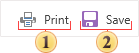
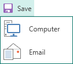

## File

In the group **File** of the tab Preview you can find commands for further actions in the report.

 Clicking this button opens the window Print, in which you should define settings for printing the report.

 The button Save contains a [list of file types](../../../Viewer/Exports/Available_File_Formats.md) the rendered report can be exported to.

It is necessary to determine where the report will be saved - on a **computer** or sent by **email**. After that you should determine the type of file in what a report will be exported.
