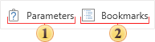

## Panels

In the **Preview** window you can include additional panels.

 With this button, you can hide or show the **Parameters** panel in the report. It should remember that if the report does not contain parameters, then this button will be disabled.

 The **Bookmarks** panel, which displays the report bookmarks. You should know that if there are no bookmarks in the rendered report, the viewer will automatically hide the bookmarks tree when you display the report first time. If there are bookmarks in the report, the viewer will automatically display the bookmarks tree.
