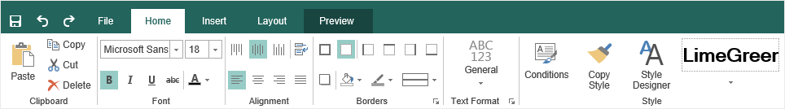

## Tabs

A tab is a part of the interface on the toolbar. The report designer has the following tabs: [Home](Tab_Design/index.md), [Insert](Tab_Insert/index.md), [Layout](Tab_Layout/index.md), [Preview](Tab_Preview/index.md).

