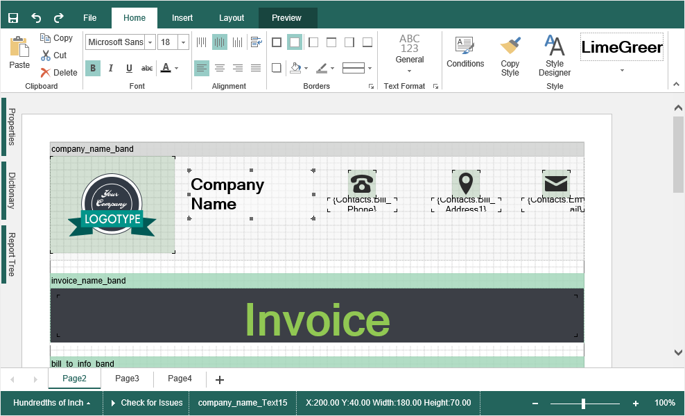

## Report Designer

The report designer is used to create and edit reports. The interface of the designer provides the user with a broad set of tools, components and tools to create reports, their visual design and preview.

