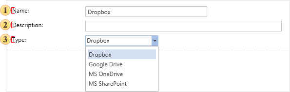
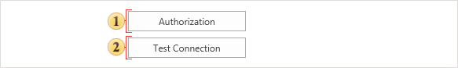
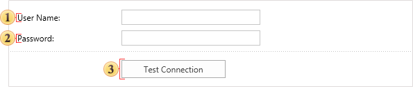
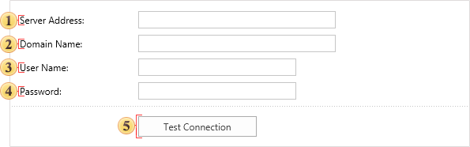

## Dropbox

This tab defines the parameters of the Cloud Storage items, and configure access to the online storage of a definite type. Consider the parameters that do not depend on the type and are always present when creating a new item.

 In the field **Name** you can put the name of a cloud storage which will be shown in the item tree.

 Enter some short information of the cloud storage in this field.

 With this option, you can change the type of the cloud storage without having to go back to the previous tab **Type**.

Now consider the parameters for each type of a cloud storage.

* Storage **Dropbox** and **MS OneDrive**

 When you click this button the report server checks the connection to the Internet and an authorization **Dropbox** or **MS OneDrive** window will be called. In the opened window, you must specify your login (email) and password.

 The button **Test Connection**. When pressed, the report server checks the internet connection, and if the connection is established, account authentication will be done. The result will be displayed in the user message.

* Storage **Google Drive**.

 This field specifies the user name. For **Google Drive** it is an e-mail of Gmail email client.

 This field specifies the password to the user account.

 The button **Test Connection**. When pressed, the report server checks the internet connection, and if the connection is established, account authentication will be done. The result will be displayed in the user message.

* Storage **MS SharePoint**.

 The address of the SharePoint server is specified in this field.

 The domain name is specified in this field.

 This field contains the name of the user account.

 This field specifies the password to the user account.

 The button **Test Connection**. When pressed, the report server checks the internet connection, and if the connection is established, account authentication will be done. The result will be displayed in the user message.
