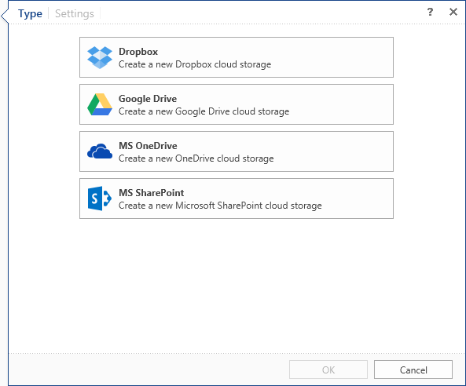

## Cloud Storage

The report server has the ability to import files from an online (cloud) storage. In addition, the cloud storage can be a destination for the result of actions of the scheduler. Access to the online store can be organized using the item **Cloud Storage**. Depending on the type of the online storage it is necessary to determine the item type of the **Cloud Storage**.

After selecting the type, click the tab **Settings** to define the settings for the online storage.
