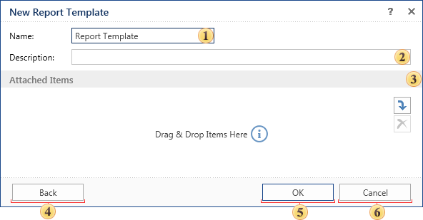

## Blank Report

In order to create a report without structure, but which may contain data or files, use the command Blank Report.

 The report item name is specified in this field.

 Description, notes that should be added to the report can be written in this field.

 You can attach additional items:

  * If the Data Source is attached, its contents (data tables, results of execution of queries and stored procedures, views, etc.) can be used when creating reports.

  * The attached item in the Report Template will be attached with respect to create reports.

  * The attached Image will be a permanent resource for the report template. In other words, you can use the attached image in the report without having to load from external sources.

  * The attached Text File can be a source of the text when working with text components of the report, including RichText components.

 Pressing this button you will go back to the menu **New report template**.

 Clicking this button the new report template will be created.

 Cancels the report template creation.
