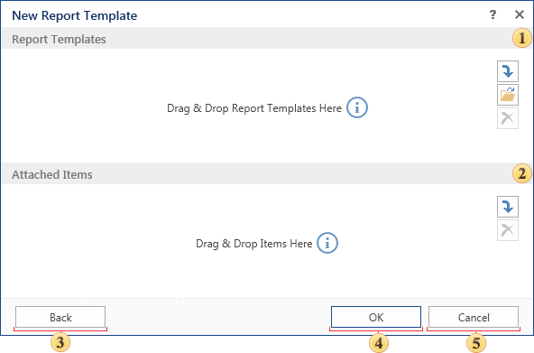

## Report from File

Another way to add a list of items in the report server is to load a report from the file. The file may be located either in the item list or any other place. Below is the menu to load a report from the file:

 This field specifies the report template file as a list of items of the report server, or from the local file system. You can also add multiple files. In this case each added file of a report template will be created as a separate item. The names of items will be generated automatically. Adding files to this panel can be done by dragging, and using the controls.

 In this field you can attach a data source to the report. Images, text files, including Rich-text, reports can also be attached to the template. If reports will be placed in this field, then they will be sub-reports in relation to the created reports.

* **Information**: If several files of report templates are specified (several items **Report** are be created), and additional items are specified too, then they (i.e. additional items) will be attached to all items **Report**.

 Pressing this button you will go back to the menu **New report template**.

 Clicking this button the new report template will be created.

 Cancels the report template creation.
