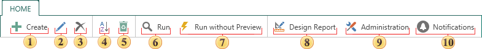
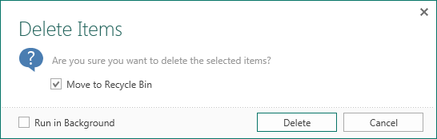
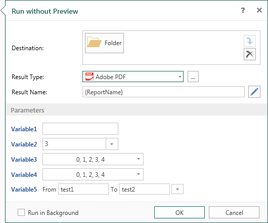

## Tab Home

Toolbar contains the basic commands of the report server and its elements. At the same time, depending on the selected element, the list of commands may be different. For example, if you select the Excel item, then the Import Data command will be available. The picture below shows the Home tab, with the commands for the **Report** item.

 The **Create** menu contains a list of items that can be added to the report server tree.

 The **Edit** button is used to edit the selected item.

 The **Delete** button is used to delete the selected item. The user will see the dialog box that is shown on the picture below.

In this window, you need to define the Move to Recycle Bin parameter, and confirm (or undo) this operation. If this option is checked, the deleted item will be moved to the trash and can be restored. If unchecked, the item will be removed forever.

 The **Sort** button. The following sorting options are available:

    * By name;

    * By type;

    * By the date of creation;

    * By the date of changes.

 The button is used to display or hide the recycle bin.

 The **Run** button. When you select this command the report is rendered and loaded into the viewer.

 The **Run without Preview** command. With this command, you can export the report without loading it in the report viewer.

1. Specify the destination for the result;
2. The type of the file, into which will be transformed a report;
3. Determine the template of the result name;
4. Specify the report parameters. If the report has no parameters, you will need to perform only the previous three steps.

 The **Design Report** button calls the report designer and loads a selected item (the report) into it.

 The **Administration** button calls the appropriate window.

 The list of **notifications** that display the progress of implementation server commands.
