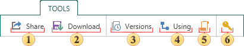

## Tab Tools

On this tab you can find the following elements.

 The **Share** command is used to call the sharing menu;

 The **Download** button saves the item as a file of a certain type. After selecting this command the dialog box will appear. In the dialog you should determine a saving location and click Save. You should know that not every item has this command.

 The **Versions** button calls the appropriate menu.

 The **Using** button calls the appropriate menu.

 The **Log** button calls the appropriate menu.

 When creating an item the unique key of the item is automatically generated. In order to obtain this key, select the command. The unique key of the item is needed for future access to this item, when using API of the report server in third-party applications. After selecting this command, the key will be displayed on the Access Key panel.
