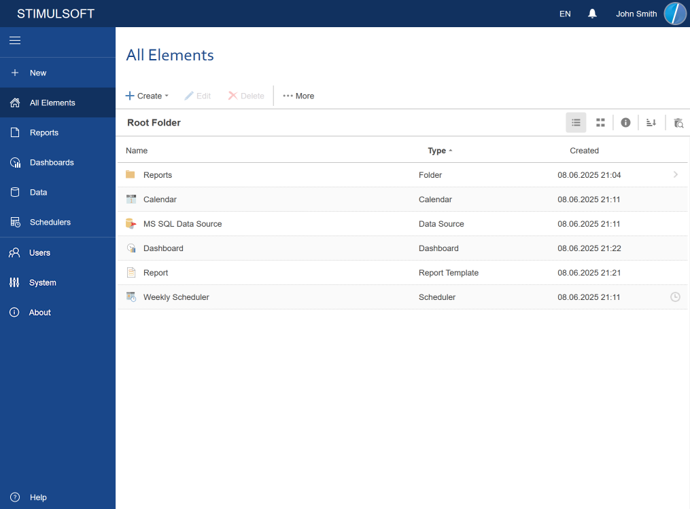

## All Elements

The **All Elements** tab provides the ability to display all the elements and all the [folders](../Toolbar/Menu_Create/Folder.md) in the current working server space:

At the same time, in the [Create menu](../Toolbar/Menu_Create/index.md), the commands for creating all server components, unless otherwise is defined by the account role, will be available.

> **Information**
>
> The list of commands in the [Create menu](../Toolbar/Menu_Create/index.md) will depend on the [Role](Users/Add_Role.md) account. The list of items will also depend on the role permissions and the user's account. Because you can specify any folder as the parent one for your account, then the list of the displayed items may be different.
