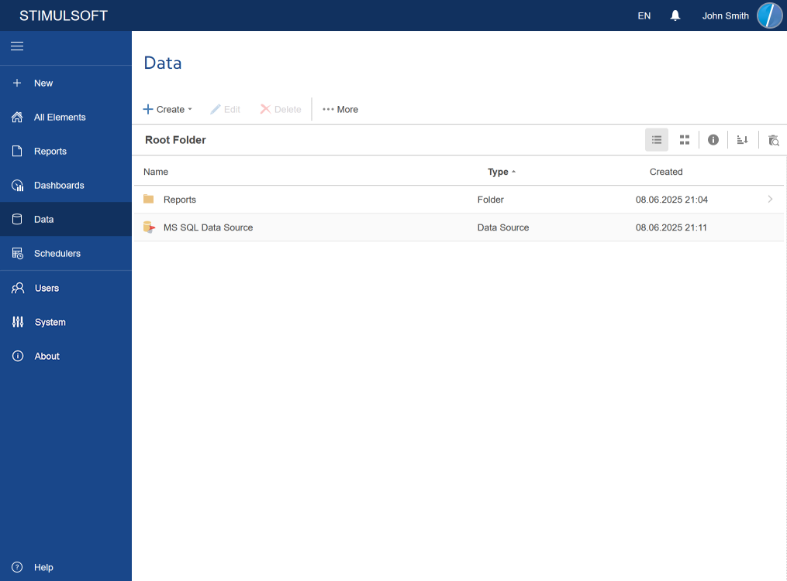

## Data

On the **Data** tab, all data sources, files (Excel, JSON, CSV, XML, DBF), which contain information such as data, **Common** and **Data** folders, will be displayed:

At the same time, in the [Create menu](../Toolbar/Menu_Create/index.md), commands for creating the [Data Source](../Toolbar/Menu_Create/Data_Source/index.md) and [Folder](../Toolbar/Menu_Create/Folder.md), unless otherwise defined by the account role, will be available.

> **Information**
>
> The list of commands in the [Create menu](../Toolbar/Menu_Create/index.md) will depend on the [Role](Users/Add_Role.md) account. The list of items will also depend on the role permissions and the user's account. Because you can specify any folder as the parent one for your account, then the list of the displayed items may be different.
