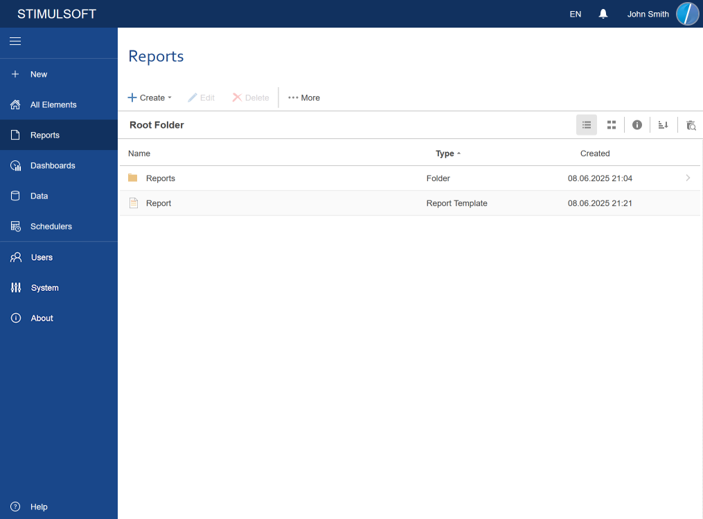

## Reports

On the Reports tab, report templates, folders of the Common type and folders of the Reports type will be displayed:

At the same time, in the [Create menu](../Toolbar/Menu_Create/index.md), the commands to create Report and Folder items, unless otherwise defined by the account role, will be available. Also, you should consider that only the file types like *.mrt, *.mrx, *.mrz will be shown. Rendered reports and converted into other formats, including formats *.mdc, *.mdx, *.mdz, will not be displayed.

> **Information**
>
> The list of commands in the [Create menu](../Toolbar/Menu_Create/index.md) will depend on the [Role](Users/Add_Role.md) account. The list of items will also depend on the role permissions and the user's account. Because you can specify any folder as the parent one for your account, then the list of the displayed items may be different.
