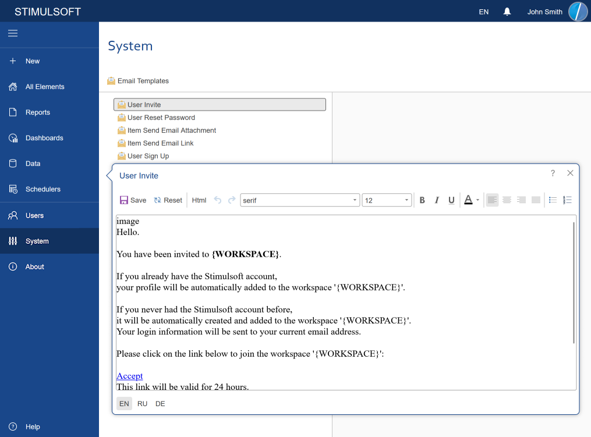
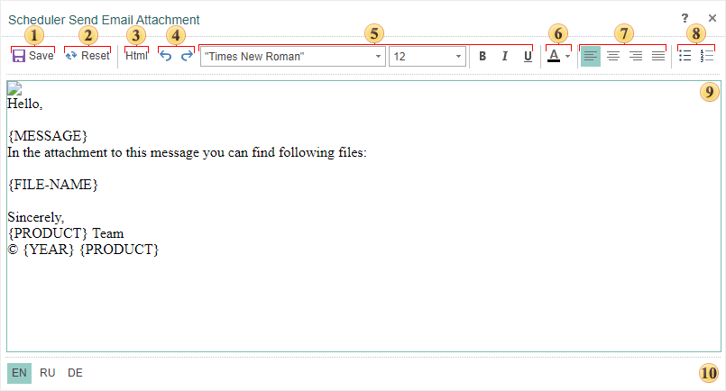

## System Tab

On the **System** tab, you can edit the Email Stimulsoft Server templates.

The templates are configured in the Email editor. To call the editor, you should:

  * Go to the System tab;

  * Click the Email Templates button on the server toolbar.

Email templates

This panel displays a list of actions, under which the user will be notified:

  * The **Item Send Email Attachment** template. The scheduler sends a letter in this template if the result (for example, a report in the converted PDF) is attached to the message.

  * The **Item Send Email Link** template. The scheduler sends a letter on this template if the link to the result (for example, a reference to the document PDF) is attached to the email.

  * The **User Activation Complete** template. A letter for the given template is sent when the user account is activated.

  * The **User Reset Password** template. When you change the password to the account, the user receives a message from this template.

  * After changing the password to an account, the user will receive an email according to the **User Reset Password Complete** template. The email address is as specified during the registration process.

Templates Editor

You can edit a letter template. Moreover, editing can be done both in visual mode and in HTML.

 The **Save** button. Click the button to save the changes after making changes in the template;

 The **Reset** button. Clicking this button, you will reset all changes, and the text will be returned to the default state.

 This button is used to switch the editing mode of the template from visual to HTML and vice versa.

 The buttons Back - Forward are used to go to the previous or next change.

 Font settings - font family, size, and style of the selected part of the email.

 The button is used to change the color of the selected text.

 Commands are used to align the selected line in the template.

 The button is used to activate the bullet mode.

 The button is used to activate the "number list " mode.

  **Localization panel**. Depending on the location, the template text will be localized to a particular language. By default, the localization pattern will correspond to the localization in the Navigator.
