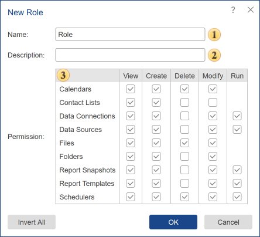

## Add Role

The **Role** is a category of users with specific rights and restrictions in the workspace. In other words, each user is assigned to a particular role, has certain rights. By default, the workspace is created with system roles:

* The **Administrator** is a role in which there are no restrictions, and all rights are included.

* The **Manager** is a role in which the user has a great number of rights, except for features for managing the basic elements of the report server (for example, the Manager cannot create and modify Schedulers, Users, User Roles).

* The **User** is a role in which the user can only view items and run some of them.

> **Information**
>
> Preset roles cannot be edited or deleted.

To create a new role, you should:

* Go to the Users tab;

* Click the Add Role button on the toolbar of the server.

Role Menu

When you create a new role, you can inherit **Permissions** from one of the existing roles selecting the parental role from the list.

 The field **Name**. Here you can put the role name.

 The field **Description**. If you need any additional description of the role, it can be put in this field.

 The field **Permission**. Consists of columns (rights) and rows (list of items). Also, the rows are split into categories. Each column defines a certain right.

  * The right **View** provides the ability to view items in the current workspace.

  * The right **Create** provides the ability to create items in the current workspace.

  * The right **Delete** provides the ability to delete items in the current workspace.

  * The right **Modify** provides the ability to edit items in the current workspace.

  * The right **Run** provides the ability to run the items in the current workspace.

In this case, the created role will be marked with checkboxes of the rights (permissions), which has a parental role. For example, if the parental role has only the ability to view reports (no other permissions), that only this permission will be given to the created role. At the same time, you can modify the role by enabling permissions or disabling them. Consider another example - the inheritance of permissions. Using the inheritance of permissions, you can create role duplicates of pre-installed roles with some modifications. By default, users as Administrators have all the rights. You want to create a role with all the features but without the permission to run Schedulers. The easiest way to do this is to create a role based on the Administrator's rights and put the restriction to run (uncheck the checkbox in the column **Run** -&gt; row **Schedulers**).

> **Information**
>
> You should know that if the users of a certain role cannot view any item, then the rest of the actions performed on this item are not allowed too. For example, the role is not authorized to view the Scheduler, but the role has the right to create and run the Scheduler. In this case, members of this role CANNOT create or run the Scheduler.

Permissions Table

In this table, you will find items (rows) and rights (columns) and short descriptions of permissions.

Items / Rights

**View**

**Create**

**Delete**

**Modify**

**Run**

[Calendar](../../Toolbar/Menu_Create/Calendar.md)

Allows viewing **Calendar**

Allows creating **Calendar**

Allows deleting **Calendar**

Allows modifying **Calendar**

[Contact List](../../Toolbar/Menu_Create/Contact_List.md)

Allows viewing **Contact List**

Allows creating **Contact List**

Allows deleting **Contact List**

Allows modifying **Contact List**

[Data Sources](../../Toolbar/Menu_Create/Data_Source/index.md)

Allows viewing **Data Sources**

Allows creating **Data Sources**

Allows deleting **Data Sources**

Allows modifying **Data Sources**

[Files](../../Toolbar/Menu_Create/File.md)

Allows viewing **Files**

Allows creating **Files**

Allows deleting **Files**

Allows modifying **Files**

[Folders](../../Toolbar/Menu_Create/Folder.md)

Allows viewing **Folders**

Allows creating **Folders**

Allows deleting **Folders**

Allows modifying **Folders**

Report Snapshots

Allows viewing **Report Snapshots**

Allows creating **Report Snapshots**

Allows deleting **Report Snapshots**

Allows modifying **Report Snapshots**

Allows running **Report Snapshots**

Report Templates

Allows viewing **Report Template**

Allows creating **Report Template**

Allows deleting **Report Template**

Allows modifying **Report Template**

Allows running **Report Template**

[Scheduler](../../Toolbar/Menu_Create/Scheduler/index.md)

Allows viewing **Scheduler**

Allows creating **Scheduler**

Allows deleting **Scheduler**

Allows modifying **Scheduler**

Allows running **Scheduler**
