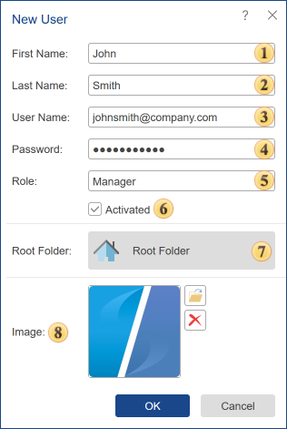
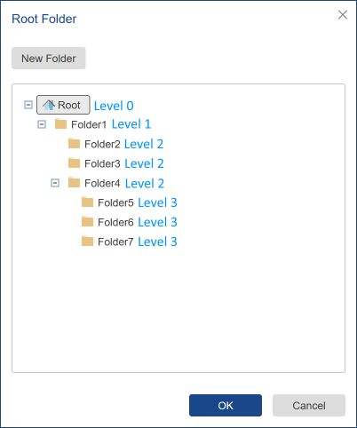
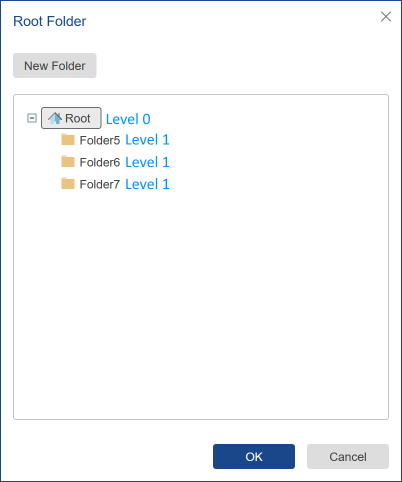

## Add User

You can add other user accounts to the workspace. Before you add a new user, you should define its role, i.e., select one of the predefined roles or create a new one. Then, click Add User in the Users tab and fill out the form shown below.

To create a new user, you should:

* Go to the **Users** tab;

* Click the **Add User** button on the toolbar of the server.

**User Menu**

In this menu, you can specify all user information and manage the user account.

 This field contains the first name.

 This field contains the last name.

 This field contains the email that will be used as user login and for authentication.

 In this field you should insert a password to protect your account from unauthorized access. Keep in mind - the combined and complex password (consisting of letters and numbers) enhances account security and reduces the risk of loss of sensitive data.

 This field specifies the role for the user account.

 Activate or Deactivate the user. The account will be activated if the checkbox is set to true. The account will be deactivated if the checkbox is set to false, and this account cannot be used to login to the server workspace.

 This field specifies the [root folder](#RootFolder) for the user account, the root folder for the server components in the current workspace.

 In the picture field, you can upload an image that will be the user's avatar.

**Root Folder**

When you create or edit a user account, you can specify the root folder for it. This folder will be the beginning of the hierarchy of server items for the current user account. Below is a diagram of components for the root administrator:

For example, for a certain user account, we specify **Folder4** as the root. Then when logging into the server workspace, **Folder4** will be the root directory for this user account, and the hierarchy of server elements will be as follows.

All elements in the workspace located in folders of a higher level will not be displayed to the current user.
