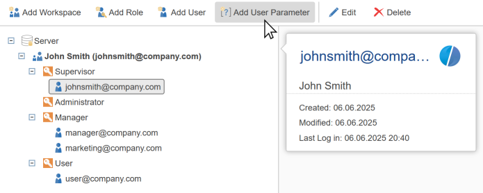
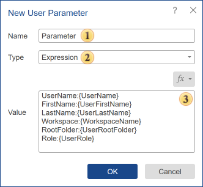

## Add User Parameter

**User Parameter** is a local variable that is automatically added to the report template when the user opens it.

> **Information**
>
> A user parameter is a local variable assigned to a specific user. It is added to the report template as a report variable when that user works with the template. When the template is used by a different user, the variables from the previous user are cleared, and the parameters of the current user are added to the template.

To create a user parameter, you should:

* Go to the **Users** tab

* Select the appropriate context: workspace, role, or specific user

* Click the **Add User Parameter** button on the server toolbar

**Creating a User Parameter**

 This field specifies the parameter name.

 This field specifies the parameter type.

 This field specifies the parameter value.

User parameters can accept string, numeric, boolean values, date, image, and expression. In user parameter expressions, you can also pass user-related data: first name, last name, username, role, parent folder name, and workspace name.

The created parameter will appear in the user hierarchy. It can later be edited or deleted using the Edit and Delete commands.

> **Information**
>
> It is important to distinguish between a report variable and a user parameter. A report variable belongs to the template. A user parameter belongs to the user and cannot override the report variable.
