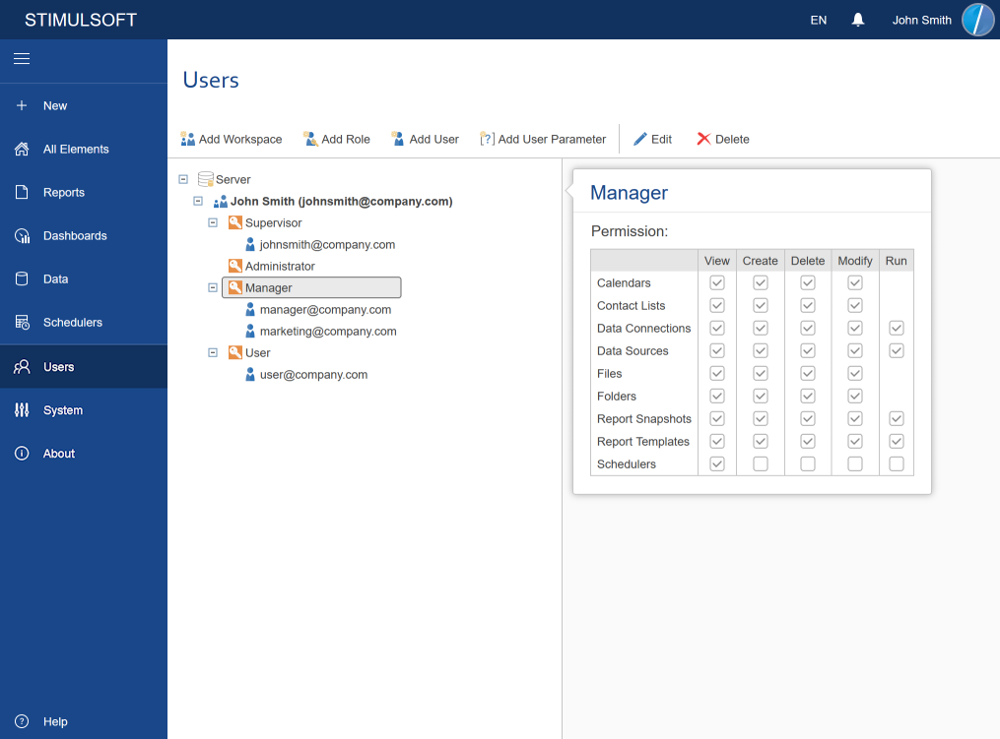
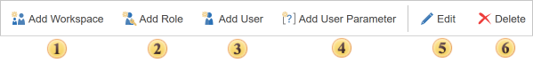

## Users Tab

All tools to control workspaces, accounts, and a system of the report server are located on the Users Tab.

Toolbar

On the **Users tab**, you can control workspaces, roles, and accounts of other users.

 **Add Workspace**. Adds a workspace on the server. Available only for Supervisors.

 [Add Role](Add_Role.md). Adds a new role in a workspace.

 [Add User](Add_User.md). Creates a new user. You must first highlight the role to which a new account will be applied.

 When you click the [Add User Parameter](Add_User_Parameter.md) button, the user parameter creation menu will be called up.

 **Edit**. Select the user (or role) and click on this button. Predefined roles (administrators, managers, users) cannot be edited.

 **Delete**. To delete a user or role, you should select a user (or role) and click Delete. Also, with the help of this button, a supervisor can remove the workspace.

> **Information**
>
> System roles cannot be edited. You cannot change the rights of the members of one of these groups.
