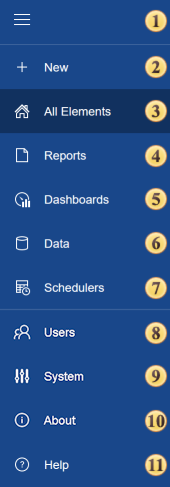

## Tabs

The tabs are used to display the items of a particular type. Also, the [Users](Users/index.md) and [System](System.md) tabs contain system commands to control users and server system, respectively:

 The expand/collapse button to the tab panel.

 The [New tab](New.md). Selecting this tab provides the ability to create a report.

 The [All Elements tab](All_Elements.md). When you select this tab, you will see all the elements, including folders.

 The [Reports tab](Reports.md). When you select this tab, folders and report items only will be displayed.
 The [Dashboards tab](Dashboards.md). Selecting this tab provides the ability to create dashboards.

 The [Data tab](Data.md). When you select this tab, folders, data sources, and only the files that contain the data (XML, Excel, CSV, DBF, and JSON) will be displayed.

 The [Schedulers tab](Schedulers.md). When you select this tab, only folders and schedulers will be displayed.

 The [Users tab](Users/index.md). This tab will display workspaces, roles, and user accounts.

 The [System tab](System.md). License and Email Templates commands will be displayed.

 The command is used to call the [About](About.md) menu.

 The command to navigate the **Stimulsoft Server**. The help files will be opened in a new browser tab.
