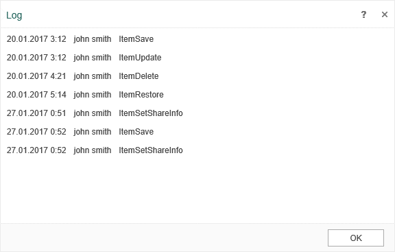

## Log

Each time when you edit and save an item, a copy of that item with the new changes is created. Thus, a history for this item is created . This history items can be viewed. To do this, select **Log** on the Toolbar.

As can be seen in the picture above, the history displays:

* The date of the latest change or action with the item;

* The user who made those changes;

* The action that was performed on this item.
