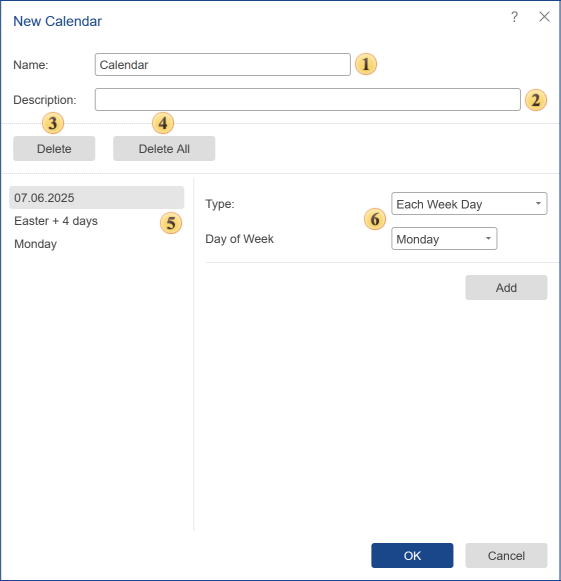

## Calendar

In addition to the direct scheduler settings, you can create a launch schedule, designate weekends, holidays and other exception dates using the Calendar element. To create a calendar, select the Calendar command in the Create menu on the server toolbar.

The calendar is configured in the New Calendar menu when creating it, or in the Edit Calendar window when editing it.

 The name of the calendar is specified in the field **Name**.

 In the field Description, you may specify additional information about the calendar or other information.

 The **Delete** button deletes the selected schedule item in the calendar

 If you want to remove all scheduler items in the calendar, click **Delete All**.

 The **Calendar** **items** panel shows all the elements of the schedule, the time and date by which the action of the scheduler will be implemented.

 On the **New Calendar** panel you can define settings of an item schedule. Depending on the Item type, other parameters may vary. Once the parameters are defined, the element, press the button Add to the element with the current settings written in the list of calendar items.

Types of calendars

Depending on the selected type, different parameters can be shown.

* The **Date** type. The parameter of the schedule is a specific day, month, year, and time. Also, a day of the week corresponding to the selected date is displayed.

* The type **Weekly**. For the calendar of this type, it is necessary to determine the day of the week.

* The type **Annual**. For the annual schedule, you should specify the month of the year and the day of the month.

* The type **Relative day** of the year. In this case, the calendar will not be "tied" to a specific date. The schedule parameters are:

  * Priority: First, Second, Third, Fourth, Last.

  * The day of the week.

  * The month of the year.

* The **Holidays** type. This type of calendar provides an opportunity to create a schedule considering country holidays. For this type, you should choose a country. After this, the list of holidays, which may be present in the schedule, will be displayed on the panel of new items. If necessary, you can add one holiday or all at once to the items of the calendar.

* The type **Easter**. Schedule for this type will be calculated off-day of Easter, which is the start date, and it measured the number of days to offset. You should know that if this year Easter has passed, the reference point is Easter next year. Consider the examples of indications of some values:

  * The minimum value that can be specified is -365. The calendar date will be a day before Easter - 365 days.

  * The maximum value that can be specified is 365. The calendar date will be the day after the Easter day +365 days.

  * If the number of days is not specified or is 0, then, in this case, the date of the calendar will be Easter (if Easter has passed this year, it will be a day of Easter next year, if the day of Easter had not yet arrived - in the current year).

> **Information**
>
> If the next year is a leap year and the date of the schedule falls on a day after February, then you should always add 1 to the offset.
