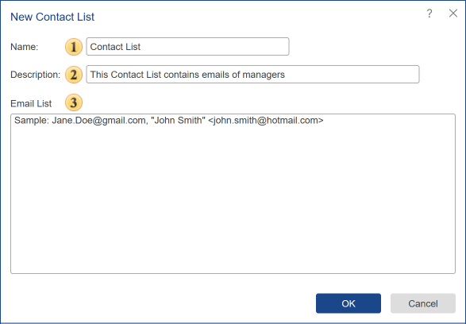

## Contact List

The Contact List is used to send reports by groups of email. Here you need to specify a list of email addresses through a separator "," or space. It should be noted that the list of contacts can be used as the destination in the following actions of a scheduler:

* [Send Email](Scheduler/Actions.md#SendEmail). In this case, text messages ( with the attached elements, if needed) will be sent by the list of contacts.

* [Run Report](Scheduler/Actions.md#RunReport). If your contact list is specified as the destination, then the report or dashboard will be converted, and the result will be sent to the email addresses.

* [Copy](Scheduler/Actions.md#Copy). When copying items, contacts can also be specified as the destination. Copies will be sent to the email addresses.

Below is the menu **New Contact List**.

 The field **Name**. Here you should specify names of **Contact List**.

 The field **Description**. You should put a brief description of the item.

 The field Email List. Here you need to place email addresses directly through the separator ",". In quotation marks, you can indicate information about the recipient, but in this case, the email address enclosed in &lt;...&gt;, like this **&lt;Email&gt;**.
