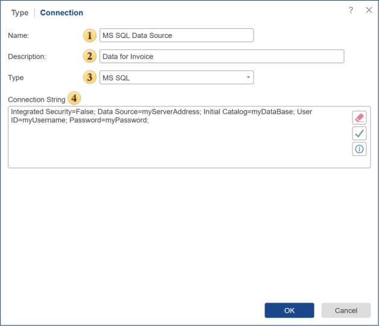
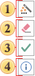

## Connection

To create a description of the data source and retrieve the data itself from storage, you should create a connection to this storage. Some parameters of the connection may vary depending on the type of the data source. The picture below shows the menu, which specifies the connection parameters to the data storage:

 The field **Name** is the name of the data source in the item tree. By default, the data source name is automatically generated, depending on its type. For example, if you select the data source ODBC, then the name of the data source is ODBC.

 In the **Description** field, you can put some notes, information on the data source.

 In the **Type** field, you can specify the type of data source without going back to the previous tab. Depending on the selected type, parameters can be changed.

 In the **Connection** **String** field, you can specify the connection string to connect to the database. Also, this field has some controls.

 Calls the **Connection String Wizard**. This control is available for specific data types.

 The command **Clean Connection String** removes all information from the connection string field.

 The command **Test** sets the test connection to the data storage.

 When you select this command, a pattern of a corresponding connection will be inserted.

Once the connection is created, you should retrieve data from the data source. You can do this in the following ways:

* Select the [Import Data](Import_Data.md) command;

* Select the [New Query](New_Query.md) command.
