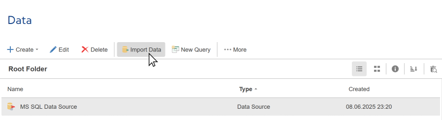
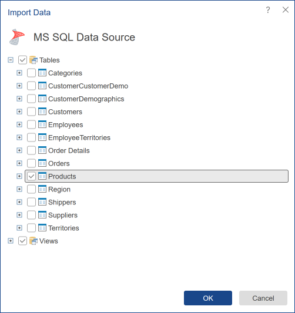
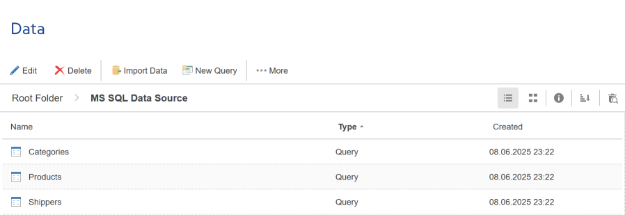
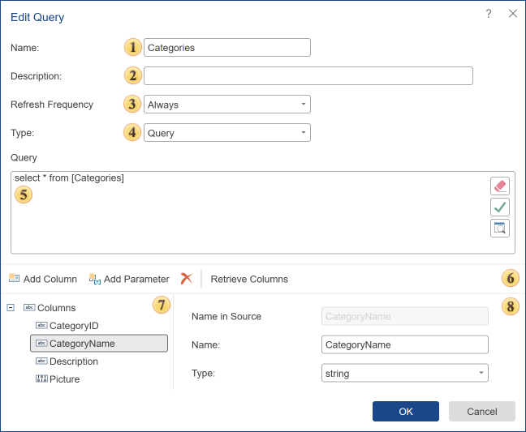
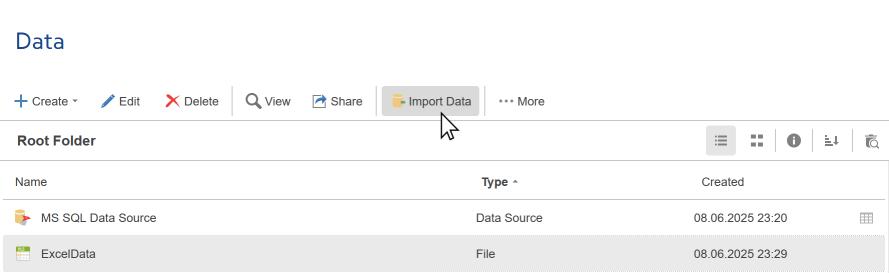
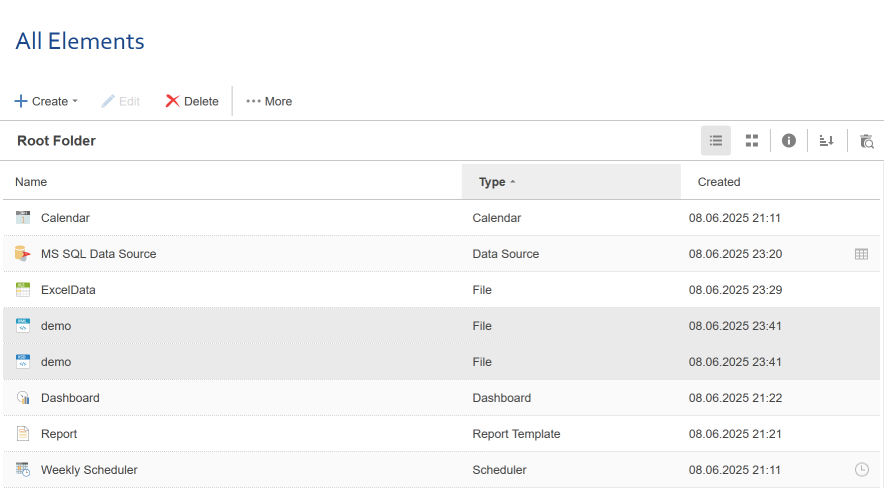
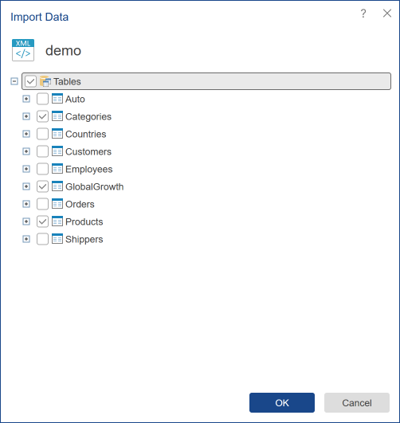
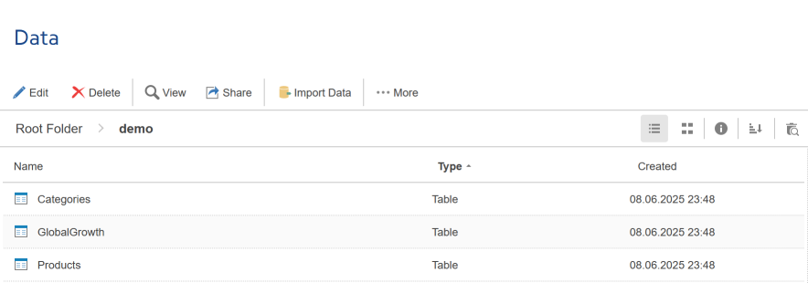

## Import Data

After creating a [connection to the data storage](Connection.md), you need to get data from it (as tables, views, stored procedures, etc.). Data can be obtained from any [created sources](#ImportData), as well as from [data files](#SampleImportDataFromFiles). Files from which data import is possible are:

  * XML files with attached XSD files.

  * JSON files.

  * Excel files (xls, xlsx).

  * CSV, DBF.

Import Data

You can get data from the storage using the Import Data command. Select the data connection and click the Import Data button on the server toolbar.

As you can see in the picture, in the item list of the server, the **MS SQL** data source is selected. When you choose the Import Data command, **Stimulsoft Server** will check the data storage for the presence of tables, views, stored procedures, etc. The result will be displayed as the **Import Data**:

In this window, the data to be added to the data source should be checked. As can be seen from the picture above:

  * Selected **data tables** Categories, Products, and Suppliers. If there are multiple items, but not all, chosen in the category, this category will be marked with 

.

  * Selected **Views**. Checking this category (in this example, in the category of views) entails the installation of flags all sub-items.

  * No stored procedures are checked.

Once the necessary tables, views, stored procedures, and other elements of the data storage are selected, press the button **Ok**. All data from the storage will be converted into a data table and displayed in the list of the server:

Now the data tables can be attached to the report. All attached tables will be displayed in the data dictionary of a report. It is also possible to attach a data source to the report. In this case, the data dictionary will have all the attached tables of the data source.

Editing data tables

You can modify data tables. For example, change the type and number of data columns. To do this, select a data table and click **Edit**.

 A name of the table that is displayed to the user in the item tree of the navigator;

 A short description and annotations to the table can be specified in this field;

 Using the **Refresh Frequency** parameter, you can set the length of time after which reconnection to the data storage will be done. The following options are available:

  * **Once** - retrieving data is carried out once when you create a data source;

  * **Every 10 Minutes** - in this case, data will be carried out every 10 minutes;

  * **Every 30 Minutes** - every half hour, the data will be updated;

  * **Every Hour** - updates go every hour;

  * **Every 4 Hour** - retrieving data will be every 4 hours;

  * **Every Half Day** - data will be updated every 12 hours;

  * **Every Day** - once a day the data will be updated;

  * **Always** - this option means that whenever you build a report, the data will be updated.

 Query Type: Query of Stored Procedure.

 Field of Query Text.

 The control panel contains the following buttons:

  * **Add Column**. With this button, you can add a data column to the data source. It should be considered that this column will contain a description. It does not contain actual data.

  * The **Add Parameter** command. Using this command, you can add an option to the category of Parameters. In this case, this parameter must be specified manually in the query.

  * **Delete Column**. Clicking this button will delete the selected columns from the data source.

  * The command **Retrieve Columns**. Once the query is created, press this button to get a column with the data from the data storage.

 This panel displays a data column in the data source.

 The settings panel of selected columns.

Also, when editing a SQL data source, you can use [parameters in the query](New_Query.md#Parameters).

Import Data from Files

The command **Import Data** provides the ability to retrieve data from files (XML, CSV, JSON, Excel, DBF) and convert them into tables. This command can be found on the **Toolbar** of the file from which it is possible to import.

Sample Import Data from File

Let’s look at how to retrieve data from an XML file. Data can also be retrieved in a similar way from Excel (XLS, XLSX), JSON, CSV, and DBF files.

Step 1: First, you need to upload the XML and XSD files to the server workspace. To do this, drag and drop the XML and XSD files from any location into the list of elements, or create a [File](../File.md) element and upload the XML and XSD files to it.

Step 2: The XSD file must be linked to the XML file. To do this, drag the XSD file onto the XML file, hover your cursor over the XSD file, hold down the left mouse button, then drag and drop it onto the XML file. Alternatively, you can link it using the XML file's Edit form. Select the XML file from the element list and click the Edit button on the toolbar. In the edit form, attach the XSD file.

Step 3: Select the XML file from the element list and click the Import Data button on the toolbar. The report server will extract the data from the file, convert it into tables, and display the result in the Import Data window.

Step 4: In this window, you can select data tables. In the example above, the selected tables are **Categories**, **Products**, **GlobalGrowth**.

Step 5: You need to click the Ok button.

After you click the Ok button, the selected tables will be displayed in the item list. Now, based on these tables, you can generate reports and dashboards.

