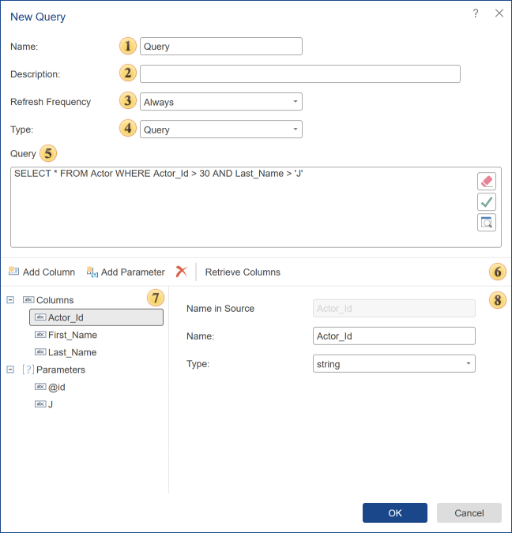
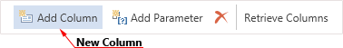
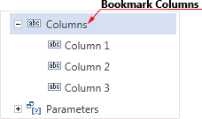
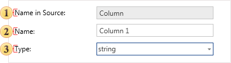
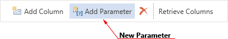
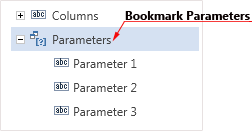
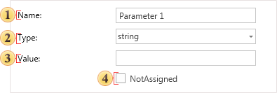
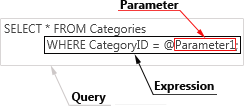
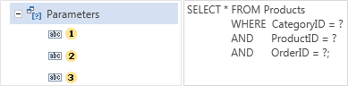
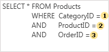

## New Query

The second way to obtain data from the storage is a method of retrieving data from the query to the repository. **Queries** are script-like texts in one of the dialects of SQL that is used to extract data from tables and to make them available to the report server. Queries get the data from database tables and, on their basis, create temporary tables. The data in the temporary table will be filtered, grouped, sorted, and arranged according to the query parameters. Then, the temporary table is passed to the report server. Applying requests provides an opportunity to avoid duplication of data in the tables, minimizes the amount of data traffic between the database and the client-side, and also provides maximum flexibility for searching and displaying data in a database. Below is the **New Query** dialog.

New Query

Select the data connection and click the New Query button on the server toolbar to create a data query. After you clicked the New Query button, the New Query menu will be called.

 The Name field indicates the name of the new request.

 In the Description field, you can specify a description for the current request.

 Using the Refresh Frequency parameter, you can set the time interval, after which the connection to the data storage will be reconnected, and the necessary data will be updated. The following options are available:

* Once - data is obtained once when creating a data source;

* Each 10 Minutes - in this case, data will be updated every 10 minutes;

* Each 30 Minutes - the data will be updated every 30 minutes;

* Each Hour - select this option to update hourly;

* Each 4 Hour - data will be updated after every 4 hours;

* Each Half Day - data will be updated every 12 hours;

* Each Day - data will be updated once a day;

* Always - this option means that every time you build a report (when accessing a data source), data will be updated.

 This field specifies the type - query or stored procedure.

 The panel **Query** contains a text field for typing a query and controls.

* The **Clear field** command, i.e., the query text will be removed;

* The **Check query** command. When you call this command, the report server will generate a test query execution. The result will be shown to the user as a message.

* When you press this button, then in the View Query window, data columns specified in the query will be displayed.

 The control panel that contains the following buttons:

* The command **Add Column** creates a new column. Keep in mind that this will be the description of the data columns, and it will not contain real data.

* The command **Add Parameter**. Using this command, you can add an option to the category of Parameters. In this case, this parameter must be specified manually in the query.

* The command **Delete** deletes the selected column or the parameter.

* The command **Retrieve Columns**. Once the query is created, press this button to get a column with the data from the data storage.

 This panel displays the data columns in this data source.

 On the **Columns** panel, you can find the following tabs.

Data Columns

Sometimes it is necessary to add a data column to the data source. To create a new data column, you must click Add Column.

You should know that the data column created this way is a description of a (virtual) data column, and it does not contain the actual data. If this column is absent in the data database, then, when referring to the database, the server will return an error. All generated data columns are displayed in the list of columns:

Also, you can change the settings of the created column.

 In the field **Name in Source** the name of the column in the data source is specified;

 In the field **Name** the name of the column that will be displayed to the user is displayed;

 The field **Type** provides the ability to select the type of the column.

Parameters

When creating a query, it is possible to use the **Parameter** object. This object is designed to send additional conditions for selecting data into a query. For example, if you need a query to use a value entered by the user each time the query is executed, you can create a query using parameters. The Parameter object can only be used with SQL data sources. These data sources typically have the Text Query field. To insert a parameter in the query, you must click the **New Parameter** button. The picture below shows the toolbar, on which the **New Parameter** button can be found.

After you click this button, a new parameter will be created. This parameter will be displayed in the **Parameters** tab in the Columns panel. The picture below shows an example of the Columns panel with the Parameters tab.

Each parameter has a property with which you can change its settings. The picture below shows the panel of parameters properties.

 The **Name** property. It is used to change the parameter name. This feature works only for named parameters.

 Use the **Type** property to change the parameter type. The values of the properties are in the drop-down list and are a list of types used in the parameters for a particular database. It should be noted that a list of types differs depending on the database.

 For each parameter, you can specify a value that is used to fill the parameter in the process of automatic request calls without any action from the user.

 If this option is enabled, then the field Value will be unavailable. By default, null or value which is specified in the stored procedure on the server will be used.

Also, you must specify the parameter in the query. Here is an example of a schematic position of parameters in the query.

As a rule, the @ symbol is used to specify a parameter in the query. The @ symbol is used with named parameters, i.e., after the @ symbol goes the name of the parameter. But in some databases (for example, in **OleDB**), the @ symbol cannot be perceived by the adapter, and database queries with parameters will not work. In this case, you can use unnamed parameters. For specifying **unnamed parameters** in the query, the ? character is used. After the ? symbol, the parameter name is not specified. In this case, the order of parameters in the Parameters tab is essential. As indications of the ? characters in the query, settings will be taken sequentially from the Parameters tab in the top-down direction. Consider the following example. Suppose three parameters are specified in the query.

Since, in this case, unnamed parameters (marked with **?**) are used, then, when running, the query parameters will be taken from the **Parameters** tab in the top-down order. The picture below schematically presents a comparison of parameters of the Parameters tab to the parameters in the query.

Moreover, the parameters used in this example must have names, but when using the ? they do not play a role.
