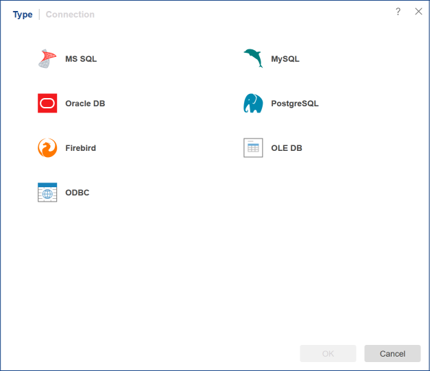

## Data Source

The data source is a structural representation of data that is used to generate reports. Each data source belongs to a particular type of connection and may vary depending on the type of data source parameters. Creating a data source can be done in several steps:

  * Select the type of connection;

  * Defining the connection parameters, i.e., [creating a connection](Connection.md).

  * Creating a [new query](New_Query.md) or [importing data](Import_Data.md).

Below is the menu of selecting the connection type:

> **Information**
>
> Data can also be obtained from certain types of files (XML, Excel, JSON, CSV, DBF). If you want to get the data from these files, it is not required to initiate the [Connection](Connection.md) to these files, but you should add them to the tree of items as the File elements. Then you should run the [Import Data](Import_Data.md) command.
