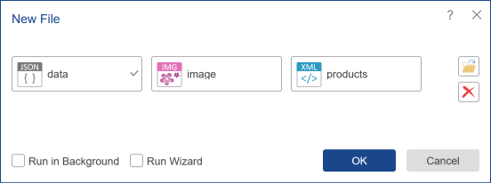
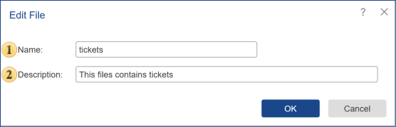

## File

You should call the **File** menu to add the required file from the storage to the list of server items or **Create** a new file based on an existing item. This command creates an object, which can contain any types of files.

The item can be attached in the following ways:

* From any storage (cloud, local drive, tree of items), you can add files by merely dragging them (Drag & Drop);

* The Control button allows adding a file from local user storage;

> **Information**
>
> These operations can be performed in the background. The background mode provides the ability to perform an unlimited number of operations simultaneously. In this case, the number of operations in the background mode depends on the technical abilities of the server. To enable the background mode, you must set the **Run in Background** checkbox in the dialog.

In this field, you can specify the number of files, and then each attached file will be created as a separate **File** item in the **Stimulsoft Server** tree. It should be considered that, in this case, the **Name** field will not be available, and the names of items in the tree will be generated automatically. Also, the **Description** field will not be available. So if you need to add or change the description of the item name that is automatically generated, then it is necessary to perform editing of the item. Clearing this field, deleting all files in this field, can be done by pressing the **Delete** button.

**Edit File**

Select File in the items list and click the **Edit** button on the server toolbar to change the name and description of the current file.

 The **Name** of the file item is specified in this field.

 The **Description** of the report item can be put in this field.
