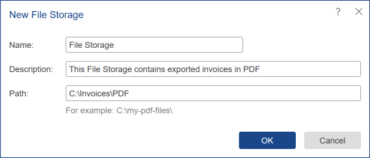

## File Storage

The **File Storage** item is used to save another element outside the server. To do this, create a file repository and specify this item as a **Destination** when performing actions with other items. For example, when copying items using the **Scheduler**, or when you run the report without previewing.

To create a **File Storage**, select the appropriate command from the **Create** menu:

* The **Name** of the file storage item is specified in this field.

* The **Description** of the report item can be put in this field.

* The **Path** by which the items will be saved is specified. If the specified directory is not created, then, when the item is saved the first time, the directory will be created.
