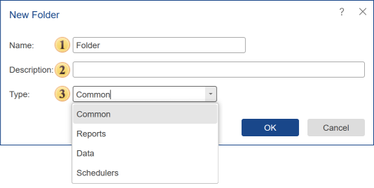

## Folder

Folders in the list of elements are necessary for organizing and storing other server elements and folders in them. Also, using folders, you can create hierarchies in the list of Stimulsoft Server elements. In addition, a folder can be the beginning of the list of elements for certain users, i.e. be the [root folder for a certain user](../../Tabs/Users/Add_User.md#RootFolder).

To create a folder, select the Folder command in the Create menu on the server toolbar.

 This field specifies the name of the folder.

 Add description, explanation, or label for the new folder.

 This field specifies the type of a folder. Depending on the type of the folder, it will appear on a particular tab:

* The **Common** type. In this case, the folder will be displayed on any tab, except for [Users](../../Tabs/Users/index.md) and [System](../../Tabs/System.md) tabs.

* The **Reports** type. In this case, the folder will only be displayed on [All Elements](../../Tabs/All_Elements.md) and [Reports](../../Tabs/Reports.md) tabs.

* The **Data** type. In this case, the folder will only be displayed on [All Elements](../../Tabs/All_Elements.md) and [Data](../../Tabs/Data.md) tabs.

* The **Scheduler** type. In this case, the folder will only be displayed on [All Elements](../../Tabs/All_Elements.md) and [Schedulers](../../Tabs/Schedulers.md) tabs.
