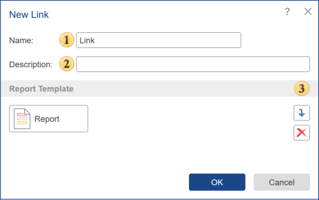

## Link

The **Link** element is a shortcut-like object designed to launch a specific report or dashboard directly. This element is useful when you need to provide users from child workspaces with access to a report or dashboard located in a parent workspace.

 The **Name** field specifies the name of the link.

 You can add a **Description** for the link in the corresponding field.

 This field displays the report or dashboard that the link points to.
