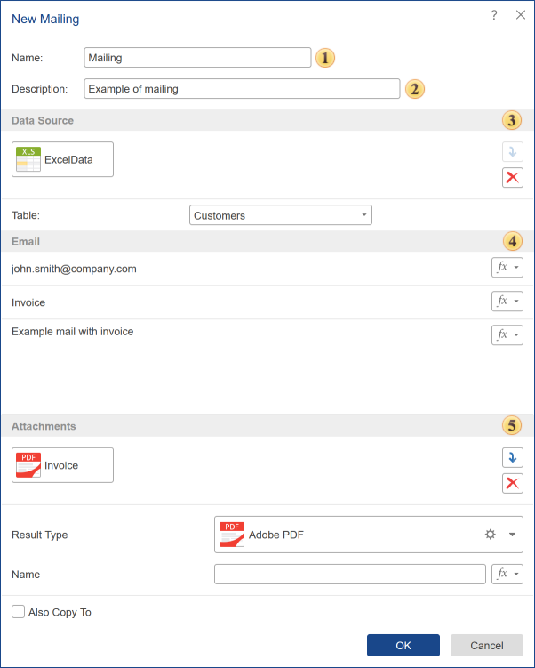

## Mailing

The **Mailing** element is used to automate email distribution. It allows you to send reports, dashboards, or other files as attachments to specific users — either manually or on a schedule using the Scheduler.

 The **Name** field specifies the name of the mailing.

 The **Description** field may contain additional details or other relevant information about the mailing.

 In the **Data Source** section, you can select a data source from which the mailing will retrieve its data.

 The **Email** section includes the sender's email address, the subject line, and the body of the email.

 In the **Attachments** section, you can add additional attached files and configure how they will be presented. The resulting attachment generated during the mailing process can also be saved to a separate folder using the **Also Copy To** function.
