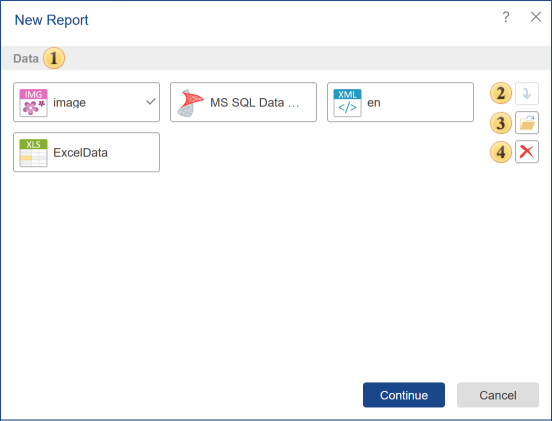

## Report

You can add the report to the list of items. Select the **New Report** panel command in the **Create** menu. In the menu that pops up, you can attach various server elements to the new report or upload files from the local storage.

 In this field, you can attach additional elements to the report.

 The button is used to add a selected server item to the current report.

 The button is used to call the Explorer to choose files from the local storage that you need to attach to a new report.

 The button is used to delete items from the list of attached items. To remove items from the list of attached items, select them with a single click and click the Delete button.

> **Information**
>
> You should know that all elements and files attached to the report will be added to its resources. This does not apply to [Data Sources](Data_Source/index.md) and [Data Files](File.md). Based on any attached data source or data file, data sources in the dictionary will be created. Also, you can use some types of files added to resources in the development of reports. For example, an attached **Text File**, a file added to report resources, can be a source of text when working with text components of a report, including a **Rich Text** component.
