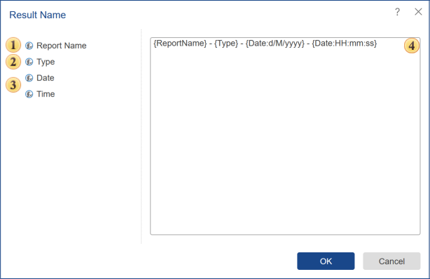

## Result Name

By default, when you convert (export) the report, the result name is generated automatically. It will consist of the report name before the conversion date plus the conversion date-time. For example, there is the .**mrt** report, "**Report1**". Let's convert the report to PDF document using the command **Run**. This will create a **PDF** document with the name **Report1-10/4/2020 2:26:55 PM**, where **10/4/2020 2:26:55 PM** is the start time (conversion) of the report. Sometimes it is necessary to set a mask (template). This can be done in the window **Result Name**.

On the right side of the window, you can find functions with which you can compose the name of the result. The left side of the window is a field in which goes the creation of the mask (template).

 The function **Report Name**. When you add this function the name of the result will contain the report name that has been converted. For example, there is a report template with the name **List of Products**. When you add the **Report Name**, the name of the result is the following - **List of Products**.

 The function **Type**. When you add this function, the result will contain the name of the type of the result. For example, if you exported a report template to PDF, then the result has the following name - **PDFXXXXXXX**.

 The function **Date** and **Time**. When you add these functions, the name of the result will contain the date (if the function is **Date**) and/or time (if the function is **Time**).

 This is the field in which a mask (template) of the result names is displayed. This field specifies the above functions and any other characters that will be identified as text.

For example, there is a report, the name of which is formed according to the following pattern **{ReportName}{Type}{Date: HH: mm: ss}**. Then the name of the result is the name **ReportPDF09: 19: 06**. Let's format the mask (template), adding spaces between the functions and the delimiter "-" (see. picture above). Then, the result after the conversion will be the following - **Report - PDF - 09:19:06**.
