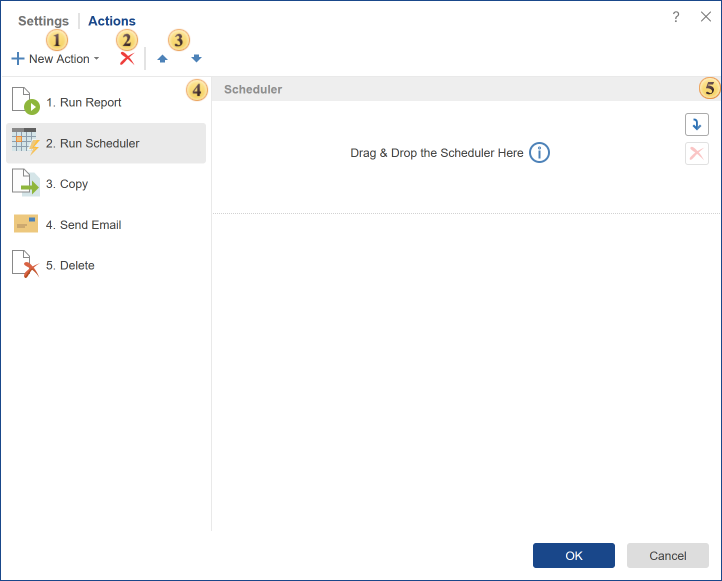
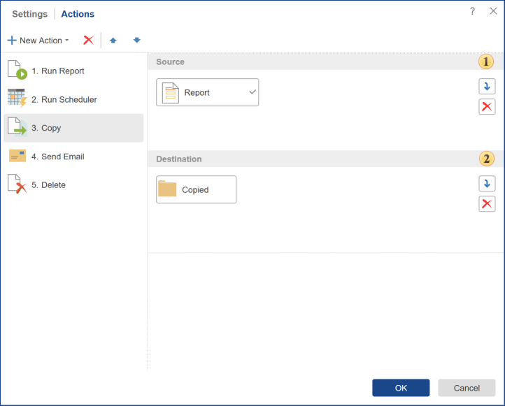
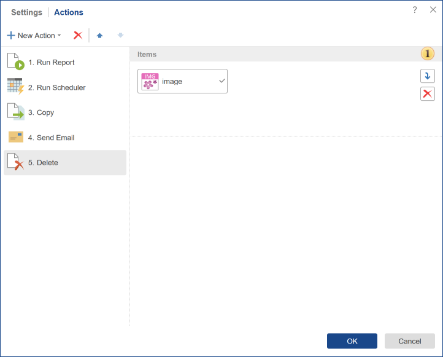
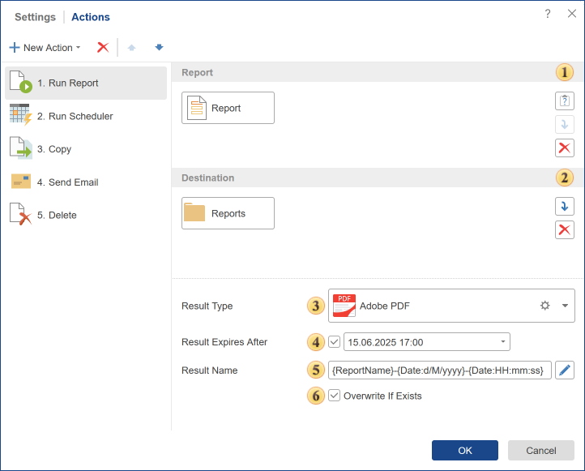
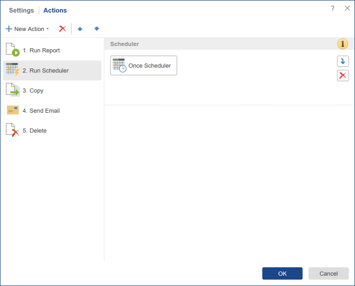
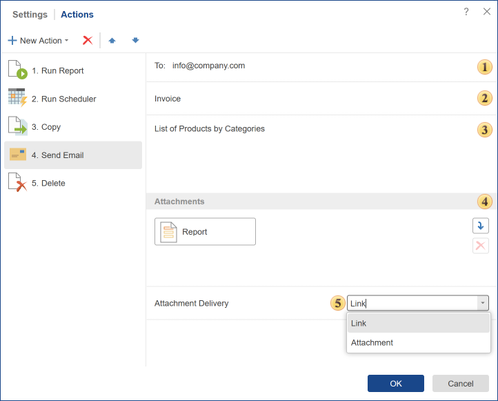

## Actions

The scheduler in the active (running) state performs a specific list of actions on schedule. Actions performed by the scheduler:

* [Copy](#Copy);

* [Delete](#Delete);

* [Run Report](#RunReport);

* [Run Scheduler](#RunScheduler);

* [Send Email](#SendEmail).

**Description of Actions Tab**

The list of actions is generated when you create or edit the scheduler on the tab **Actions**. Actions are executed alternately in the scheduler, in the direction from top to bottom. The higher is the location of a particular action in the generated list of scheduler actions; the higher is the order of execution.

 The drop-down menu contains a list of actions available for the **Scheduler**.

 Delete the selected action from the actions list.

 Moves the selected action up and down, increase-decrease execution priority.

 The panel list of actions. This panel displays the added action, those that will be executed each time you run the Scheduler.

 The panel of parameters of the selected action.

> **Information**
>
> Methods for adding elements to the action parameters panel:
>
> * Drag an element from the server elements list to the current panel.
>
> * Select an element in the server elements list and click the **Add** button on the action parameters panel.

**Copy**

Copying elements can be done using the scheduler. And, at the same time, you can copy multiple items, but to one destination. You cannot specify multiple destinations for copying. In addition, you can copy items to the list of contacts. In this case, a copy will be sent to the e-mail addresses from your contact list. You can also copy the item to an item. In this case, you must consider the following restrictions:

* Similar types of objects in the fields **Source** and **Destination**. It is impossible to copy **Report** to **File**, or vice versa.

* It is allowed to use only one item as the destination.

Below is the action menu **Copy**.

 This field specifies the elements that will be copied.

 In the field of this parameter, you should specify the destination for the copies. This can be a folder, a list of contacts, cloud storage, etc. For example, if you specify a folder, the items will be copied to this folder. It is also possible to copy one item to another.

> **Information**
>
> If you specify the [contact list](../Contact_List.md) as the destination, it will be necessary to determine how to attach items to e-mail. Items can be directly attached as an attachment to the letter, or links to these items will be attached.

**Delete**

The item can be removed by a certain schedule. To do this, add the **Delete** action in the scheduler and specify the items that must be removed when the scheduler triggers.

 The list of items that will be removed when the scheduler is triggered.

**Run Report**

The action **Run Report** is used to start the rendering of a report at a specific time, or to convert the report to any of the available file formats. After rendering, the report can be saved into the item tree, cloud storage, emailed, etc. Below is a menu of the action run a report.

 The field **Report**. In this field, you can specify the report template or a rendered report, the item that you want to convert. If the report uses parameters, then click the button 

 to change the default settings.

 The field **Destination**. It specifies the destination of the output file, location of the report after the conversion. This may be a folder, a list of contacts, etc. For example, if you specify a folder, the report will be converted and saved in it. If the destination is a list of contacts, the report will be converted and sent to all recipients present in the contact list.

> **Information**
>
> If you specify a contact list item as the destination, it will be necessary to determine the method of attaching the report to an email. The report can be directly attached to the email as a file, or a link to this report will be attached.

 In the field of this parameter, you can determine the **Result Type** the report should be converted to.

 If you want to delete the result after a specific date and time automatically, then it can be done using this parameter. To do this, you must check the box and specify the time. When the date and time come, the file will be automatically moved to the recycle bin.

 This field contains the template of the [result name](../Result_Name.md).

 The **Overwrite If Exists** parameter provides an opportunity to rewrite the result. If this option is disabled, then each time you perform this action, the result will be represented as a separate item, if the report is converted once an hour, then a new item in the tree will appear every hour or sent according to the list of contacts. In this case, the names of these items may be similar. If this option is enabled, and the names are identical, then each new result is overwritten instead of the previous one.

> **Information**
>
> For example, every hour a report named **Report** is converted to a **PDF** document. If the **Overwrite If Existing** parameter is disabled, then after four launches, there will be four elements named **Report** in a certain directory.
>
>
> If the **Overwrite If Existing** parameter is enabled, then after four launches, there will be one element **Report** in the same directory. It is also worth noting that this element will have 4 [versions](../../Versions.md).

**Run Scheduler**

The action **Run Scheduler** provides the ability to run another scheduler. In other words, one scheduler can run the other, and that one is already carrying out any action. For this action, it is necessary to consider the following limitations:

* The slave scheduler is the one that will run another scheduler must be of the type **Once**;

* One level structure. You cannot run a scheduler that will run another scheduler that will run the third scheduler. In other words, it is impossible to build a multilevel hierarchy of action.

Below is a menu of the action **Run Scheduler**.

 The slave scheduler. It will run when the **Run Scheduler** action of the main scheduler is executed.

**Send Email**

One of the actions that can be performed by a scheduler is sending emails. To do this, use the **Send Email** action. Below is a menu of this action.

 This field **To**. Specifies the address to which the email will be sent. The list of email addresses should be filled through a separator "," or space. The field is mandatory.

 The field **Subject**. Here you need to write a subject of the message. The field is not mandatory.

 The field **Message**. Here you need to write a text of the message. The field is mandatory.

 **Attachments**. If necessary, you can attach certain items into it. You should add items from the Navigator tree. The field is not mandatory.

 **Attachment Delivery**. Items can be directly attached as an annex to the letter, as well as references to this item.
