## Settings

On the **Settings** tab, you can define scheduling parameters. Depending on the selected type, the number and names of the parameters may vary.

This chapter will cover the following:

* [Description of Settings Tab](#Description);

* [Common](#Common);

* [Frequency](#Frequency) and [Time Zone](#TimeZone). The scheduler may be [daily](#Daily), [weekly](#Weekly), [monthly](#Monthly), [yearly](#Yearly), [calendar](#Calendar), [once](#Once).

* [Repeat](#Repeat);

* [Range](#Range);

* [Exception](#Exception);

* [Notify](#Notify).

**Description of Settings Tab**

Scheduling parameters are presented in groups.

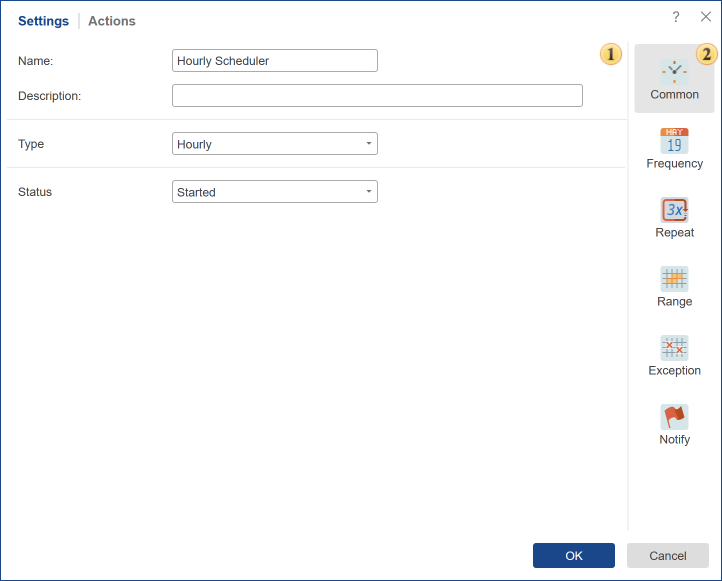

 The panel **Settings**. This panel displays a list of options, depending on the selected group.

 This panel contains a list of parameters.

> **Information**
>
> The number of groups may vary depending on the [type of scheduler](index.md#Types).

**Common**

This group of a parameter contains general settings that do not depend on the type of the selected scheduler.

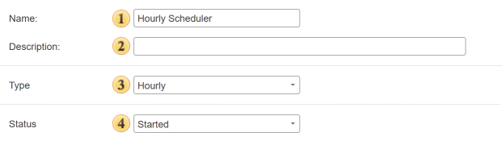

 In the **Name** field, you can set the name of the scheduler.

 This field is used to describe the scheduler. The description is used for making notes and explanations for the scheduler.

 With this option, you can change the **Type** of the scheduler without going back to the previous tab.

 This parameter defines the status of the scheduler after it is created. If you select the state **Started**, the scheduler will be active after saving and work according to the schedule. If you choose the status **Stopped**, the scheduler will not be active when you save it, and the schedule will not be executed.

> **Information**
>
> The parameter **Status After Creation** is not available if you select a single scheduler. The parameter **Run After Creation** is available instead of that parameter. If this box is checked, the scheduler will work after saving and perform defined actions. If the box is not checked, the scheduler does not work, and it is possible to start it or to use another scheduler manually.

**Frequency**

This group contains parameters by which the scheduler is running. Some of the settings in this group will vary depending on the type of scheduler. Here is an example of the parameters of the hourly scheduler.

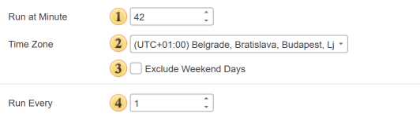

 The **Run at Minute** parameter specifies the minute for each hour, upon the occurrence of which the scheduler will trigger.

 The parameter **Time Zone** indicates the time zone, which will be considered by the scheduler.

> **Information**
>
> Always pay attention to the **time zone** because wrong time zone definitions will cause the scheduler running at the wrong time.
>
>
> Suppose you want to perform an action for the scheduler at 14:00. Depending on the geographical location, i.e., due to differences in time zones, the response time of the scheduler can vary significantly. For example, the east and the west coast of the United States refers to the different time zones. Eastern - (GMT -5:00), West - (GMT -8:00), so the difference in time will be 3:00 at this moment. To calculate time in a different time zone, you must specify the time and time zone. Therefore, if you set the time of 15:01, determine the time zone GMT -8:00, then the scheduler will work at 15:01 on the west coast or in 12:01 - the east coast. This parameter will be present in all types of the scheduler, except the Once.

 The **Exclude Weekend Days** option. This parameter allows you to prevent the scheduler from running on weekends (Saturday and Sunday). If the checkbox is selected, the scheduler will not trigger on Saturdays and Sundays. Any missed executions will be deferred to the next working day — that is, Monday. The total number of executions will remain unchanged: for example, if the scheduler was supposed to run 5 times over the weekend, it will run 5 times on the next working day.

> **Information**
>
> When enabling this parameter, keep in mind that it can also be used in combination with an exclusion calendar. In this case, the system will determine the next available execution day that is not listed in the exclusion calendar and does not fall on a weekend (Saturday or Sunday). If the exclusion calendar contains many entries and this parameter is enabled, there may be a significant delay in the scheduler's execution relative to the initially defined date. This happens because all exclusion conditions must be met in order for the scheduler to run. If the checkbox is not selected, the scheduler will operate normally, according to the defined schedule. This parameter is available for all scheduler types except for One-time and Calendar-based schedulers.

 The **Run Every** parameter sets the shift when the scheduler triggers. For example, if the value is 1, the scheduler will be triggered every time as scheduled. If the value of this parameter is 2, the scheduler will be triggered through 1 time, every second time in the schedule, etc. This option has in all schedulers, except the Once and Calendar.

Let's look at other types of schedulers and their schedules:

**Daily**

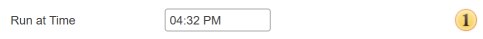

 Under this option, you must specify the exact time when the scheduler runs. Then, every day, if there are no exceptions, the scheduler will perform specific actions at the specified time.

**Weekly**

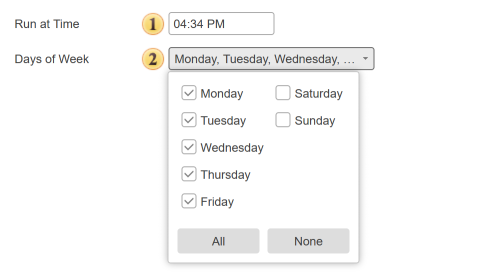

 In this field, you must specify the exact time the scheduler should trigger. Be sure to take into account the AM (midnight to noon) and PM (noon to midnight) format.

 You also need to select the days of the week on which the scheduler will run. If no days are selected, the scheduler will not run according to this schedule. To include a day of the week, check the corresponding box. To exclude a day from the schedule, uncheck the box. There are also two buttons available: **All** — selects all days of the week. **None** — clears all selected days

**Monthly**

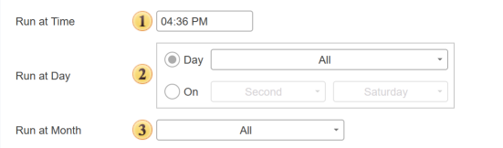

 In this field, you must specify the exact time the scheduler should start. Be sure to take into account the AM (12:00 midnight to 12:00 noon) and PM (12:00 noon to 12:00 midnight) format.

 This parameter allows you to select specific days of the month. The following options are available:

* Select the ordinal number of the day in the month. In this case, you need to check the boxes for the specific day numbers on which the scheduler should run. You can also select the Last checkbox, which means the scheduler will run on the last day of the selected month. There are also two buttons available: **All** — selects all days of the month (except the Last checkbox). **None** — clears all selected days, including the **Last** checkbox

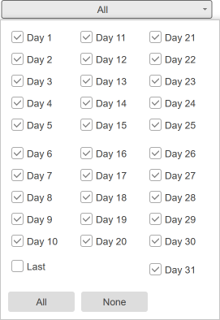

* Defining a relative day of the month. In this case, you need to select the order of the day (e.g., first, second), and then choose the days of the week, such as Monday and Friday. In this example, the scheduler will trigger on the first and second Mondays and Fridays of the selected month.

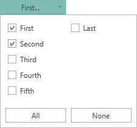
 
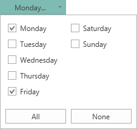

You can select the desired order and day of the week by checking the corresponding boxes. If no order or no day of the week is selected, the scheduler will not run based on this schedule. Two additional buttons are available: **All** — selects all days of the week **None** — clears all selected days of the week

 Selecting months is done using this parameter. You can select one or multiple months.

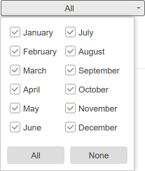

To include a month, check the corresponding box. If no months are selected, this schedule will be considered inactive. Two buttons are also available: **All** — selects all months. **None** — clears all selected months

**Yearly**

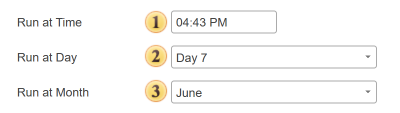

 Under this option, you must specify the exact time when the scheduler runs. Then, every year, if there are no exceptions, the scheduler will perform certain actions at the specified time.

 With this parameter, you can set the day of the month on which the scheduler will run.

 Months of the year in which you will run the scheduler is defined using this parameter. If the month has already passed, the selected schedule will work next year.

**Calendar**

When you select this option you must specify a calendar with a schedule (the calendar contains a list of specific dates):

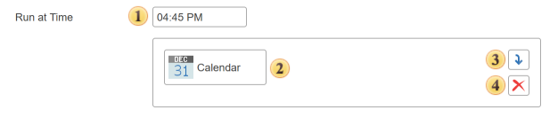

 In this field, you should specify the exact time when the scheduler triggers. The calendar indicates only the dates, so the time of running is defined on the tab Calendar.

 The added item [Calendar](../Calendar.md).

 The button is used to add the selected item from the tree to the panel of the scheduler.

 The **Delete** button is used to delete an item from the panel of the scheduler.

**Once**

In this case, the scheduler works immediately after creation. It should be known that the scheduler will not work if to uncheck the parameter Run After Saving. In this case, the running must be implemented manually, i.e., select this scheduler and select the command **Run Once** on **Toolbar**. Also, the scheduler of this type can be started by another scheduler through the action **Run Scheduler**.

**Repeat**

Sometimes you need to repeat the scheduler operations after its actions by the schedule have been executed. You can enable the repetition and configure it in the group **Repeat**:

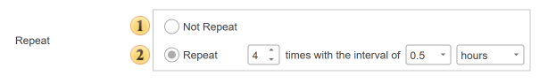

 This radio button turns **on/off** the repeat mode.

 Includes the repeat mode and provides the ability to set the repeat options:

* The first parameter defines the number of repeats after the scheduler is executed;

* The second value defines the range of 0.5; 0.25; 1, etc.

* The third parameter specifies the unit: hours or minutes. Depending on the selected unit, the repeat interval will be calculated.

> **Information**
>
> The picture above shows an example of the enabled repeat mode: 3 repeats with an interval of half an hour after each execution of the schedule. Suppose there is a scheduler which runs daily at 10.00 AM. If the repeat mode is enabled (see the picture above), the scheduler will run:
>
> * at 10.00 AM on a daily schedule;
>
> * at 10.30 AM will be the first repeat;
>
> * at 11.00 AM will be made to the second repeat;
>
> * at 11.30 AM will be made the third repetition.
>
>
> The next day, the scheduler will run at 10.00 AM, and if the repeat mode is enabled, the repetitions will be performed.

**Range**

The group of parameters **Range** provides an opportunity to specify the interval when the scheduler works. In other words, the scheduler will only work if its schedule falls within the range:

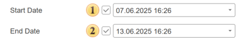

 With this parameter, you can specify the beginning of the range. Check the checkbox and select a date-time.

 The end of the range is set using this parameter. You must also check the checkbox and select a date-time.

> **Information**
>
> For example, on July 30, 2014, we will create a daily scheduler, which must be executed at 10.00 AM. Next, we will define the range from July 31, 2014, from 8.09 AM to August 2, 2014, 8.09 AM. In this case, the scheduler will run on July 31, August 1, August 2. On other days, the scheduler will not be executed because its schedule does not fall within the specified range.

**Exception**

Sometimes, on specific dates, the scheduler mustn't run. A list of these dates (exceptions) is made in the item calendar. Next, the item is added to the scheduler and will be considered as a list of exceptions. For example, a daily scheduler is running, but the 4th of July is a holiday, and it is not necessary to run the scheduler. Therefore, it is essential to create a calendar with the date July 4, and then drag it out of the item tree to the panel of exceptions. Now, this scheduler will not run on July 4.

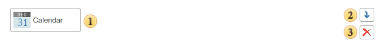

 The item [Calendar](../Calendar.md) that contains the dates of exceptions.

 The button is used to add the selected item from the tree to the panel of exceptions. In this case, the item Calendar.

 The button is used to delete an item from the panel of exceptions.

> **Information**
>
> When using exceptions, you should take into account the value of the [Time Zone](#TimeZone).
>
>
> For example, the scheduler is launched daily, but July 4 is a holiday and there is no need for the scheduler to be triggered. Therefore, you should create a calendar with the date July 4, and then drag it from the list of items to the exceptions panel. Now this scheduler will not be triggered on July 4.

**Notify**

In this group of parameters, it is possible to set up a list of users who will get notifications of the executed scheduler. You can notify all users of the workspace, or users with a specific role, or users by selection.

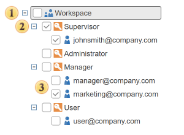

 In order notifications of the executed scheduler send to all the users in this workspace, you should select this checkbox.

 If you check the role, all users in this role will be notified of the executed scheduler.

 In addition, it is possible to notify users selectively.
