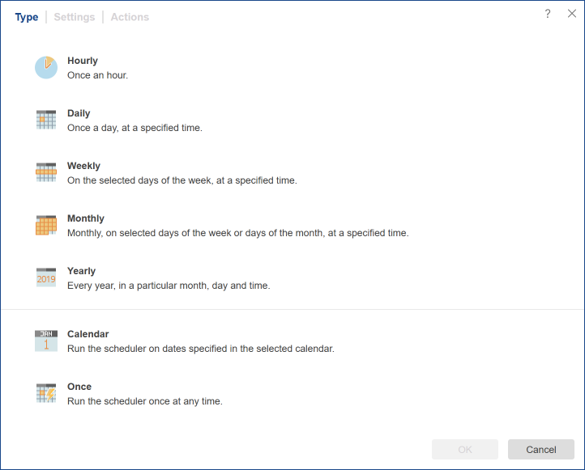

## Scheduler

The **scheduler** is one of the main tools of the report server, using which you can plan specific actions at a particular time. To do this, you need to create a scheduler and specify the time and actions that you must perform. For example, at the beginning of each hour (at a specific minute), the report will be rendered, exported to **PDF** format and sent via email to particular persons. The picture below shows a window to create a new scheduler:

To create a scheduler, you should

* Select the Scheduler command in the Create menu;

* Select the Create scheduler command in the context menu on the item list panel.

Also, you can edit a scheduler, for this, you should:

* Select the scheduler in the list of server elements and click the Edit button;

* Select the scheduler in the list of server elements and select the Edit command in the context menu of the scheduler.

The scheduler is configured in its editor.

Scheduler Editor

The scheduler editor consists of the following tabs - Type, Settings, and Actions.

As can be seen from the picture, the scheduler consists of the following tabs:

* In the Type tab you can specify time when the scheduler should run.

* In the [Settings](Settings.md) tab, you can set up the scheduler.

* In the [Actions](Actions.md) tab, you can specify the list of what should be done with the scheduler.

Scheduler Types
On the Type tab, you can set up when the scheduler should run, when the scheduler actions will be executed. Frequency can be set as follows:

* [Hourly](Settings.md#Frequency). The scheduler will perform some action every hour, at a certain minute of every hour (minute configurable).

* [Daily](Settings.md#Daily). The scheduler is executed once a day, depending on the specified time (hour and minute).

* [Weekly](Settings.md#Weekly). In this case, the scheduler will be executed once a week on the specified day, at the time (hour and minute). Also, you can specify the required days of the week. For example, you can specify all the days of the week, or only Monday or Monday + Friday + Saturday.

* [Monthly](Settings.md#Monthly). This type of scheduler provides the ability to create a schedule at a certain time during the month. Moreover, it is possible to select the months; schedule will only work on certain months.

* [Yearly](Settings.md#Yearly). In this case, you can set the time (hours and minutes), a month and a day when the scheduler runs.

* [Calendar](Settings.md#Calendar). In this case, you should specify the calendar, a list of items of which will be a timetable for the scheduler.

* [Once](Settings.md#Once). Any action will be executed once, after running the scheduler. Typically, such a scheduler is started by another scheduler or manually.
