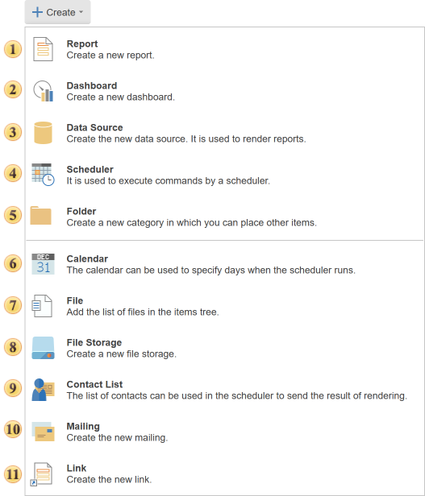

## Menu Create

The tab **Create** contains commands with which new items are added to the list of items.

 The command [Report](Report.md) calls a menu to create a report or upload it from the file.

 The command [Dashboard](Dashboard.md) calls a menu to create a dashboard or upload it from the file.

 The command [Data Source](Data_Source/index.md) is used to create a new data source

 The command [Scheduler](Scheduler/index.md) is used to execute commands on the schedule, add new ones.

 The command [Folder](Folder.md) is used to organize and store items in right places. You can create a hierarchy of folders in the list of items.

 The command [Calendar](Calendar.md) is used to create a calendar. For example, you can create a calendar to run the scheduler.

 The command [File](File.md) is used to add a file to the list of items.

 The command [File Storage](File_Storage.md) is used to create directory in which can save the contents of the server items.

 The command [Contact List](Contact_List.md) is used to create a list of contacts. For example, the contact list may be used by the scheduler, i.e. can form a permanent list of contacts by what users will receive the results by e-mail.

 The command [Mailing](Mailing.md) calls a menu to create a mailing list.

 Command to call the creation of a [Link](Link.md).
