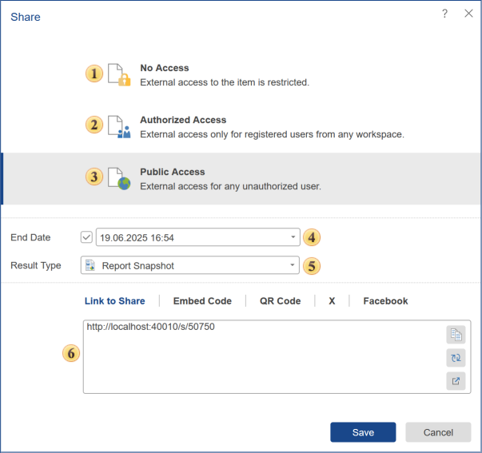
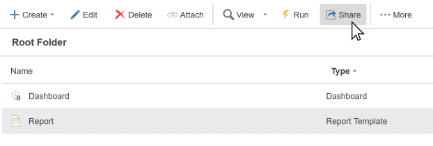
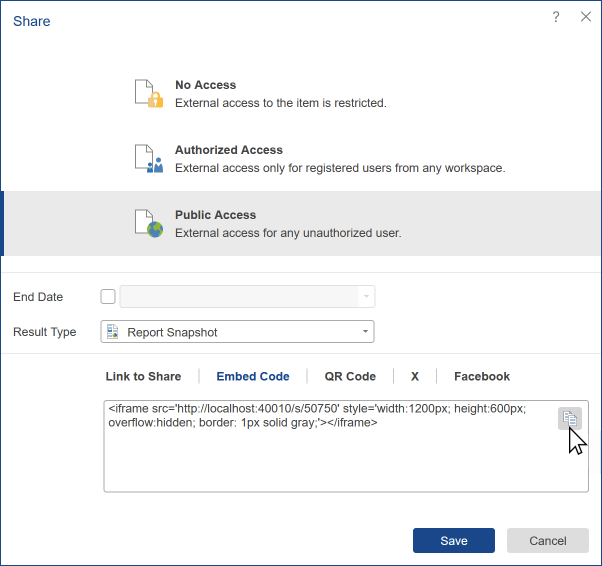
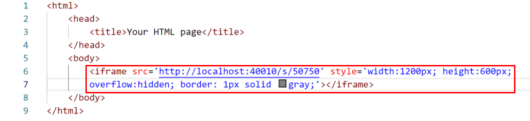
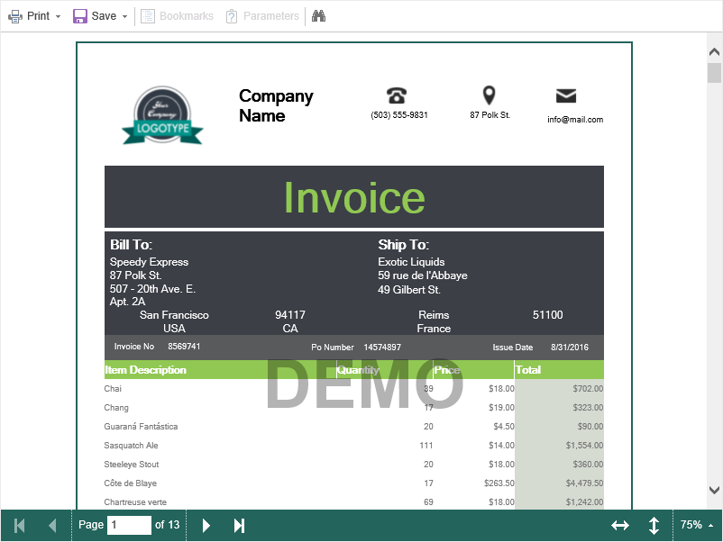
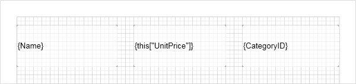
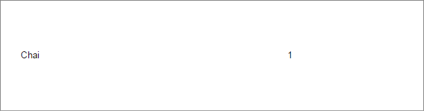
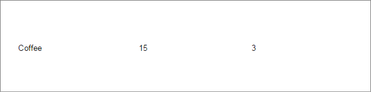

## Sharing Settings

In **Stimulsoft Server**, you can provide remote access to view a report or dashboard, and download them after converting them to other file types. This can be done using the Share command. Access settings are configured in the **Access** menu.

This chapter will cover the following:

* [Share menu](#ShareMenu);

* [Embedding the access code to an item in the HTML page](#EmbedCode);

* [Parameters in URL](#ParametersInURL).

To open the **Share** menu, you should:

* Select the report or dashboard element in the list of server items;

* Click the **Share** button on the server toolbar.

**Share menu**

You can specify share settings of the report or dashboard in this menu.

 The first mode sets the access only to users of the workspace. In other words, only users of the workspace will have access to this item.

 In this mode, access to the item will have all the registered users on the server, regardless of whether they belong to a particular workspace.

> **Information**
>
> Regardless of the access to the item **(No Access Share** or **Authorized Access)**, it is necessary to take into account the rights of the [user roles](../Tabs/Users/Add_Role.md). For example, if the user does not have the right to view the report item (not allowed in the settings of the role), when setting the level of access **No Access Share** or **Authorized Access**, the user will still be able to view the item.

 With this mode, there are no restrictions on the access level. The item will be public for any non-authorized user. In other words, everyone who has the link to this item can view it.

 This parameter sets the time and date after which access will be closed. If this option is disabled, then there is no period of access, access is always enabled.

 The **Result Type** parameter allows you to select the file type to which the report or dashboard will be converted.

 The link to access an item can be provided in the following ways:

* **Link to Share**. Get only a link to this item.

* **Embed Code**. Get the code for the HTML page with the link to this item.

* **QR Code**. Display the QR code. When reading this code, you will automatically get a link to access the item.

**Embedding the access code to an item in the HTML page**

The item to which it is possible to adjust the level of access can also be embedded into the HTML page. This requires the following conditions:

* The report server must be deployed on any web server.

* Access level of the item must Public Access.

**Step 1**: You should select an element in the list of **Stimulsoft Server** elements. Let's say, a report.

**Step 2**: Select the **Share** item on the toolbar.

**Step 3**: Define access settings. Set public access and, if necessary, set the **End** parameter value.

**Step 4**: Go to the **Embed Code** tab.

**Step 5**: Copy the access code.

**Step 6**: Open the html page with any editor and paste the code. For example, let's open the html page with notepad:

**Step 7**: Save changes.

**Step 8**: Open the html page in the browser.

**Parameters in URL**

Users can view reports depending on the access level. For example, a report can view any or only authorized users. However, the report parameters can be used. In this case, the transfer of parameters goes via the URL. To do this, you must specify the special character "**?**" at the end of the **URL**. After this character, the name of the parameter and its value is specified. If you want to specify several options, they should be written with a separator "**&**". Consider an example of passing parameters to the report through a URL. Below is a report template.

In the first and the last text component, you can find references to a variable - **Name** and **CategoryID**. The default values for these variables are **Chai** and **1**, respectively. In the text component in the middle of the page, you can see the expression with the keyword this and the parameter **UnitPrice**. Below is the rendered report.

As can be seen from the picture above, the default values were passed to the report. At the same time, UnitPrice did not keep any value and, therefore, it is not present in the rendered report. Let's pass parameters via URL.

* The access link to an item -  [http://localhost:40010/s/5fc3c](<%LINK_CAPTION%>).

* For the parameter Name the value will be Coffee;

* For parameter UnitPrice - 15;

* For the parameter CategoryID - 3.

Then the URL with parameters will look like this [http://localhost:40010/s/5fc3c?Name=Coffee&UnitPrice=15&CategoryID=3](<%LINK_CAPTION%>). Below is a report with the passed parameters.

