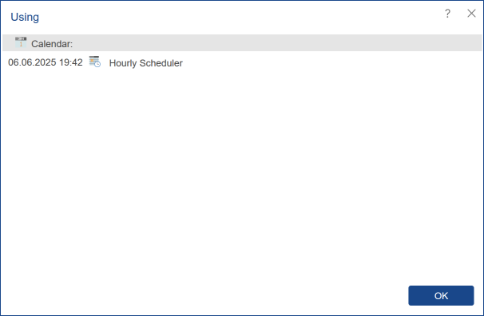

## Using

Items in the report server can be used by other elements or can be attached to them. For example, the data source may be attached to the report, and the folder can be used as the destination source in the scheduler. In this case, it is impossible to remove used or attached items. At the same time, the same item can be attached (used) by an unlimited number of other items. In other words, the corresponding data source can be attached to various reports, and the same folder can be used in multiple schedulers.

To find out where the item is used, you should do the following:

* Select item;

* Click the Using button in the ...More menu on the server toolbar.

As can be seen from the picture above, the **Using** menu shows the following information:

* The name of the item about which information is requested. In this case, it is Calendar.

* Date and time of attaching to another item.

* The list of items where the selected item is used. In this case, these is  Hourly Scheduler.
