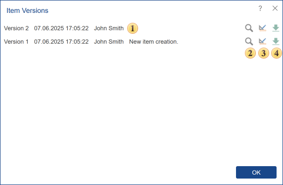

## Versions

Sometimes, when editing items, especially when multiple users can modify the same items, some issues may occur. As a consequence, it is necessary to cancel the last, previous, and other changes, go back to the previous version of this item. It should be known that for each item change, a copy of this item state is created. And this state does not overwrite its previous state. Therefore, you can always refer to any copy of an item. This can be accomplished in the menu **Versions** of a selected item. This menu contains commands, as well as all versions' history of the item.

To call the Versions menu, you should:

* Select an item in the list of server items;

* Click the Versions button in the ...More menu on the server toolbar.

 The version history of an item includes the version number, date, time, user name, and description of changes.

In the above example, you can see versions of the item [Report](Menu_Create/Report.md), and therefore it has the following operations:

 Buttons are used to run a specific version of the report. When you press this button, the report will be rendered and loaded in the report viewer. Each version has its button for running the item. For example, **Version 2** corresponds to the start button in the same line.

 The buttons to load a specific version of the report in the report designer. Each report version has its button to open the report in the designer. For example, **Version 2** of the report corresponds to the button in the same line.

 Report download button. Each version of the report has its own download button.

> **Information**
>
> Depending on the item type (the version of the item), the operation performed with versions may be different.
