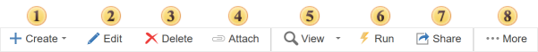
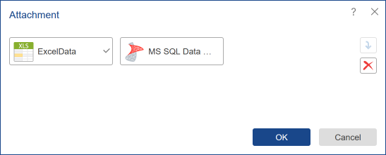
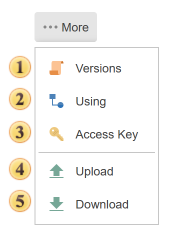
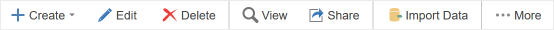
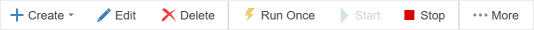
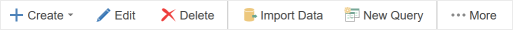

## Toolbar

The toolbar contains the basic commands of the report server and its elements. At the same time, depending on the selected element, the list of commands may be different. The picture below shows the toolbar, with the commands for the **Report** and Dashboards item.

 The [Create](Menu_Create/index.md) menu contains a list of items that can be added to the report server list.

 The **Edit** button is used to edit the selected item.

> **Information**
>
> If the [report](Menu_Create/Report.md) or [dashboard](Menu_Create/Dashboard.md) is selected, then selecting this command, the report will be uploaded to the report designer. In the [Details panel](../Display_Panel/index.md), you can edit the name and description of the report or dashboard item, as well as other items of the server.

 The [Delete](../Display_Panel/Recycle_Bin.md) button is used to delete the selected item. The user will see the dialog box that is shown in the picture below.

 To attach a server element to the report, you need to select the report item and select the **Attachment** command. It will call a menu in which to specify the items that you want to attach.

 The View button. When you select this command, the report is rendered and loaded into the viewer.

 The **Run** command. With this command, you can export the report without loading it in the report viewer.

 The [Share](Share.md) command is used to call the sharing menu;

 The ...More menu contains other commands of item management:

 The [Versions](Versions.md) button calls the appropriate menu.

 The [Using](Using.md) button calls the appropriate menu.

 When creating an item, the unique key of the item is automatically generated. To obtain this key, select the command. The unique key of the item is needed for future access to this item when using the API of the report server in third-party applications. After selecting this command, the key will be displayed on the Access Key panel.

 The **Upload** command allows uploading the file to the server workspace.

 The **Download** button saves the item as a file of a particular type. After selecting this comman,d the dialog box will appear. In the dialog, you should determine a saving location and click Save. You should know that not every item has this command.

> **Information**
>
> Depending on the item type, a list of commands in the toolbar may be different.

Below is toolbar for Excel, XML, JSON, CSV, DBF files:

Some commands are not available, and there is a team of [Import Data](Menu_Create/Data_Source/Import_Data.md#ImportDataFromFiles).

Below is toolbar for [schedulers](Menu_Create/Scheduler/index.md):

The toolbar contains commands for the scheduler: Run Once, Start, Stop.

Below is toolbar for [data sources](Menu_Create/Data_Source/index.md)

The toolbar contains [New Query](Menu_Create/Data_Source/New_Query.md), and [Import Data](Menu_Create/Data_Source/Import_Data.md) commands.
